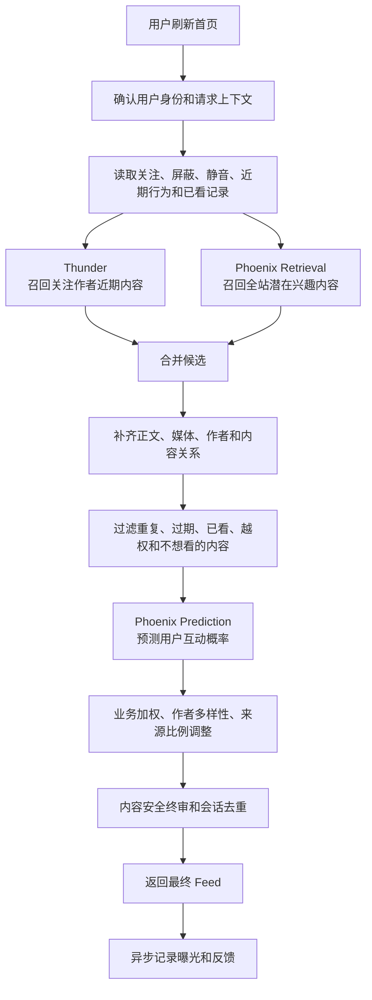
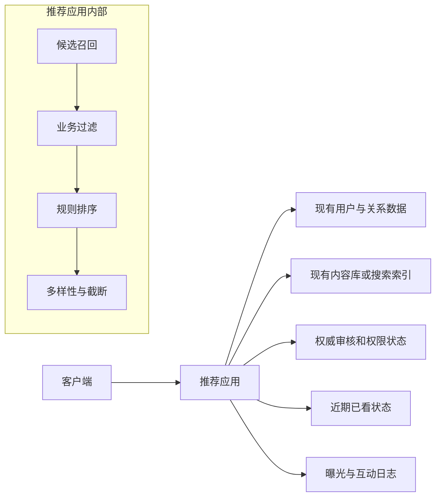

# 推荐服务外部依赖梳理与 MVP 建设建议

> **状态**：`design`  
> **面向读者**：产品负责人、业务负责人、推荐服务建设负责人  
> **文档目的**：基于当前仓库梳理推荐业务流程和外部依赖，判断哪些能力首版必须具备、哪些可以延后、哪些不应复制，为自研推荐服务的范围决策提供依据。  
> **事实边界**：当前仓库可以跑通演示链路，但不等同于已具备生产能力；本文会明确区分“当前代码事实”和“建议目标方案”。

---

## 1. 执行摘要

当前项目展示的是一套较完整的推荐系统目标形态：

1. 实时接收内容；
2. 从关注网络和全站内容中寻找候选；
3. 补齐内容、作者和用户资料；
4. 删除重复、过期、已看、无权限或不安全的内容；
5. 根据用户兴趣进行排序；
6. 做作者多样性、安全终审和结果截断；
7. 记录曝光与互动，为后续去重、分析和模型训练提供数据。

它最值得参考的不是服务数量，而是下面这条业务链：

> **内容供给 → 用户理解 → 内容补全 → 业务过滤 → 排序 → 安全交付 → 数据反馈**

对自研首版的总体建议是：

- **参考当前项目的业务职责，不复制 X 的服务名称和拆分方式。**
- 首版采用一个推荐应用，复用已有用户、内容、关系和审核系统。
- 首版使用规则召回、规则过滤和规则排序，不使用随机模型承担业务排序。
- 内容安全、曝光记录和用户反馈必须从第一天建设。
- Kafka、Thunder、Phoenix、向量索引和自动训练平台，都应在出现明确业务需求或规模瓶颈后再引入。

推荐的 MVP 定义：

> **基于真实内容和真实用户关系的轻量推荐 Feed，通过规则召回、规则过滤和规则排序，保证安全、去重和数据闭环；暂不建设机器学习召回与排序平台。**

---

## 2. 当前项目能做到什么，不能做到什么

### 2.1 已经具备的参考价值

当前项目已经提供：

- 完整的推荐请求编排流程；
- 关注网络和全站探索两类候选来源；
- 去重、时效、关系、权限和已看过滤框架；
- 模型打分、业务加权、作者多样性和来源比例调整；
- 内容安全过滤和降级思路；
- 演示用的端到端服务调用链；
- 训练、向量索引和持续更新的目标架构文档。

### 2.2 不能直接视为生产完成的部分

当前项目的演示链路中，以下内容可能仍是模拟、占位或未闭合状态：

- 用户资料；
- 关注、拉黑、静音关系；
- 用户近期行为；
- 帖子正文和作者资料；
- 内容审核结果；
- 全站候选池；
- 模型权重和特征；
- 曝光状态持久化；
- 调用方身份认证；
- 模型训练、索引构建和发布平台。

`home-mixer/runtime_config.rs` 当前明确拒绝进入 `production_ready` 模式。因此应将该项目理解为：

> **一套完整度较高的编排骨架和演示闭环，而不是可以直接部署的生产推荐系统。**

---

## 3. 当前项目的业务流程

### 3.1 端到端流程



### 3.2 各环节解决的业务问题

| 环节 | 解决的问题 | 缺失后的结果 |
| --- | --- | --- |
| 用户身份 | 确认推荐对象，防止冒用用户 | 无法保证推荐结果属于真实用户 |
| 内容供给 | 找到可以推荐的内容 | Feed 为空或内容长期不更新 |
| 用户理解 | 知道用户关注谁、喜欢什么、不想看什么 | 所有人看到近似内容 |
| 内容补全 | 获得正文、作者、媒体、删除和权限状态 | 无法正确展示或过滤 |
| 业务过滤 | 去掉重复、过期、已看、拉黑、越权内容 | 体验差，甚至产生安全问题 |
| 排序 | 决定哪些内容优先展示 | 内容顺序随机或只按发布时间排列 |
| 多样性 | 避免同一作者、同一话题刷屏 | Feed 单一、容易疲劳 |
| 内容安全 | 确保最终内容可展示 | 违规、删除或无权限内容泄漏 |
| 曝光反馈 | 判断推荐是否有效，并支持后续训练 | 无法评估，也无法做真正个性化 |

### 3.3 一个关键判断

当前项目不是“模型中心”设计，而是“编排中心”设计。

模型只解决候选之间的优先顺序，不能替代：

- 内容审核；
- 删除和权限状态；
- 拉黑、静音和不感兴趣；
- 已看去重；
- 作者多样性；
- 结果不足时的降级和兜底。

---

## 4. 外部依赖能力全景

这里的“外部依赖”指推荐系统运行时依赖的业务能力和基础设施。

> **一项能力必须存在，不代表必须单独建设成微服务。**
>
> 例如内容安全必须存在，但首版可以读取内容表中已经计算好的审核状态，而不一定新建实时审核服务。

### 4.1 核心业务数据与安全能力

| 外部能力 | 当前项目对应项 | 业务价值 | 当前成熟度 | 自研首版建议 |
| --- | --- | --- | --- | --- |
| 用户身份与调用方认证 | Viewer、普通 RPC 身份边界 | 确认“为谁推荐”，防止伪造用户 | 生产合同未闭合 | **必须保留**，复用现有登录和网关 |
| 权威内容数据 | TES | 正文、作者、发布时间、媒体、删除状态 | 真实实现缺失，Demo 使用占位数据 | **必须保留**，直接使用现有内容库或内容 API |
| 内容安全与审核 | Visibility Filtering | 阻止违规、删除、越权内容进入 Feed | Demo 直接放行，默认模式保守降级 | **必须保留业务能力**，可先读取审核字段 |
| 关注、拉黑、静音关系 | Strato、Social Graph | 构建关注流，执行用户明确偏好 | 多为占位接口 | 有关系体系时首版接入 |
| 作者基础资料 | Gizmoduck | 作者状态、昵称、账号资格等 | 真实实现缺失 | 首版只取必要字段 |
| 用户近期行为 | UAS Fetcher | 判断近期兴趣，为个性化排序提供输入 | Demo 使用合成数据 | 在线服务可延后，但数据必须积累 |
| 曝光和互动日志 | Impressions、Action Log | 评估效果、构造训练样本 | 需要业务侧自建真实链路 | **首版必须记录** |
| 已看和已下发状态 | seen IDs、served IDs、Feed State | 降低连续刷新时的重复 | 当前生产持久层未完成 | **首版做轻量版本** |
| 服务监控 | Metrics、Health、Readiness | 发现空结果、超时和候选不足 | 当前观测面不完整 | **首版保留最小监控** |

### 4.2 实时内容供给能力

| 外部能力 | 当前项目对应项 | 业务价值 | 当前成熟度 | 自研首版建议 |
| --- | --- | --- | --- | --- |
| 实时事件总线 | Kafka | 快速同步发布和删除事件 | Thunder 正常模式依赖 | 通常延后；已有 Kafka 时可复用 |
| 关注网络实时缓存 | Thunder | 快速查询关注作者的最新内容 | 主干可运行，但生产闭环不完整 | 延后，首版可查数据库或搜索索引 |
| 关系查询 | Strato 或替代关系服务 | 获取用户关注作者列表 | Thunder 内部实现仍是 stub | 复用现有关系表或 API |
| 内容删除同步 | Kafka Delete Event | 让下线内容快速退出候选池 | 依赖真实事件生产者 | 首版可从权威内容状态过滤 |

Thunder 的核心价值是“把关注作者最近发布的内容维护成高速货架”。它解决的是规模和实时性问题，而不是首版推荐闭环问题。

### 4.3 模型召回与排序能力

| 外部能力 | 当前项目对应项 | 业务价值 | 当前成熟度 | 自研首版建议 |
| --- | --- | --- | --- | --- |
| 个性化精排 | Phoenix Prediction | 预测用户对候选内容的行为概率 | 服务原型可运行，真实权重和特征缺失 | 延后 |
| 全站个性化召回 | Phoenix Retrieval | 发现非关注但可能感兴趣的内容 | 演示候选池主要为模拟数据 | 延后 |
| 用户、帖子、作者特征 | Feature Store、Embedding Tables | 给模型提供个性化输入 | 当前主要是 Mock | 延后 |
| 向量检索 | FAISS、Milvus、Vespa 等 | 从大规模内容池中快速寻找相似内容 | 尚未形成完整生产接入 | 首版不建设 |
| 模型产物存储 | Checkpoint、对象存储 | 保存模型和向量索引版本 | 存在部分代码与目标设计 | 延后 |
| 模型注册与发布 | Model Registry | 模型灰度、切换和回滚 | 轻量原型 | 延后 |
| 训练调度 | Airflow、Flyte、cron 等 | 定期生成样本、训练和发布 | 文档更多是目标方案 | 延后 |
| 训练计算资源 | GPU、TPU | 训练召回和精排模型 | 需外部提供 | 延后 |

当前 Phoenix 的随机模型只适合验证链路，不能承担真实业务排序。它可以证明“服务调用正常”，不能证明“推荐结果有效”。

### 4.4 可选和旁路能力

| 能力 | 当前项目状态 | 首版判断 |
| --- | --- | --- |
| VM Ranker 二次重排 | 默认关闭 | 不建设 |
| Phoenix MoE 召回 | 默认关闭 | 不建设 |
| 独立话题召回 | 非默认主链 | 不建设，先用分类或热门池 |
| 请求缓存写回 | 默认关闭 | 不复制 X 的形态，按自身存储实现 |
| Ads、Prompt、WhoToFollow、PushToHome | 默认不可达或未接主链 | 从内容推荐 MVP 移除 |
| Grox | 不进入默认推荐 Feed | 不纳入方案 |
| 复杂冷启动采样 | 可选能力 | 数据规模成熟后再评估 |

---

## 5. 首版能力取舍

这里的“删除”是指不进入自研首版蓝图，不是删除当前仓库代码。

### 5.1 首版必须保留

| 能力 | 建议实现方式 | 保留原因 |
| --- | --- | --- |
| 单一推荐入口 | 一个推荐应用完成候选查询、过滤、排序和返回 | 交付快，问题容易定位 |
| 用户身份校验 | 复用现有登录、网关和会话 | 防止伪造用户和越权读取 |
| 内容查询 | 直接批量读取现有内容库、搜索索引或内容 API | 推荐必须依赖权威内容状态 |
| 最低限度内容安全 | 只允许已发布、审核通过、未删除、有权限内容 | 安全不能等模型成熟后再补 |
| 关注和屏蔽关系 | 复用现有关系表或 API | 这是最直接、最可解释的个性化信号 |
| 基础过滤 | 过期、重复、已看、拉黑、静音、自己发布 | 直接决定用户体验 |
| 规则排序 | 新鲜度、热度、关系、类别偏好、作者多样性 | 可解释、上线快、不依赖训练数据 |
| 曝光和互动埋点 | 异步记录展示、点击、停留和正负反馈 | 没有数据就无法评估和训练 |
| 最小去重状态 | 客户端携带已看 ID，服务端保存近期曝光 | 防止连续刷新重复 |
| 最小监控 | 请求量、延迟、空结果率、候选量和过滤量 | 推荐常见故障是“服务正常但没有内容” |
| 规则配置能力 | 参数可调整、可回滚 | 方便运营和业务快速验证 |

### 5.2 延后建设

| 能力 | 延后原因 | 建议启动条件 |
| --- | --- | --- |
| Kafka 实时内容流 | 首版可直接查近期内容 | 数据库压力明显，或要求秒级上新、删除 |
| Thunder 独立缓存 | 主要解决大规模关注流性能 | 关注数、内容量或请求量成为瓶颈 |
| Phoenix 精排 | 没有真实反馈数据时模型价值有限 | 已有稳定曝光样本和可靠评估 |
| Phoenix 全站召回 | 需要训练、内容编码和索引运维 | 关注和热门候选无法满足发现需求 |
| ANN 向量索引 | 与大规模个性化召回绑定 | 活跃内容池超出普通查询能力 |
| 在线行为序列服务 | 首版可用少量近期行为或离线聚合 | 需要实时捕捉兴趣变化 |
| 独立作者资料服务 | 首版可批量读取用户表 | 作者资料查询成为性能瓶颈 |
| 分布式 Feed State | 首版可以容忍少量跨设备重复 | 多实例、跨设备重复成为核心投诉 |
| 自动训练和发布 | 初期可以人工验证和发布 | 模型开始稳定按周或按日迭代 |
| Feature Store | 初期特征数量少，可直接计算 | 多模型共享特征且一致性问题频发 |

### 5.3 首版不复制

- VM Ranker 二次重排；
- Phoenix MoE；
- 独立 Topic 召回服务；
- X/Strato 形态的请求缓存；
- Ads、Prompt、WhoToFollow、PushToHome；
- Grox；
- 多模型、多目标、多阶段复杂融合；
- X 特有的 Strato、TES、Gizmoduck 等服务命名和组织方式。

---

## 6. 推荐的 MVP 方案

### 6.1 MVP 业务定位

> **先证明真实内容能够被安全、稳定、可解释地推荐出去，并形成完整反馈数据，再决定是否模型化和服务化拆分。**

### 6.2 最简业务架构



部署上可以只有一个推荐应用；代码内部仍应保留“召回、过滤、排序、记录”等模块边界，方便未来独立演进。

### 6.3 请求输入

首版只需要：

- 已认证用户 ID；
- 已看内容 ID；
- 页面大小；
- 首屏或翻页标志；
- 必要的语言、地区和客户端上下文。

首版不引入：

- MoE 开关；
- 复杂话题模式；
- 缓存候选对象；
- 多模型调试字段；
- 大量实验型参数。

### 6.4 候选来源

#### 有成熟关注关系的产品

1. 主候选：关注作者最近 24～48 小时发布的内容；
2. 兜底候选：全站近期热门且审核通过的内容；
3. 可选补充：用户偏好类别中的近期内容。

#### 没有成熟关注关系的产品

1. 全站近期内容；
2. 分类热门内容；
3. 用户主动选择的兴趣类别；
4. 编辑精选或运营内容池。

这种情况下不需要建设 Thunder，因为 Thunder 的核心价值就是服务关注网络。

### 6.5 必须过滤的内容

- 已删除、未发布、审核未通过；
- 用户无权查看；
- 拉黑或静音作者；
- 用户已经看过；
- 同一内容重复；
- 超过业务新鲜度窗口；
- 同一转发或同一会话大量重复；
- 用户明确表示不感兴趣；
- 用户自己发布的内容，可作为产品开关。

### 6.6 首版排序信号

建议第一版只使用以下可解释信号：

1. **新鲜度**：发布时间越近，基础优先级越高；
2. **关系强度**：关注作者、经常互动作者适当提高；
3. **近期热度**：使用时间衰减后的点击、点赞、评论、分享；
4. **类别偏好**：用户主动选择或近期频繁消费的类别；
5. **负反馈**：不感兴趣、屏蔽和举报强降权或直接过滤；
6. **作者多样性**：限制同一作者在前列的数量；
7. **来源平衡**：防止结果全部来自热门池或全部来自关注流。

不需要复制 Phoenix 的多行为预测头。首版规则应满足：

- 能解释；
- 能人工调整；
- 能快速回滚；
- 能通过数据验证。

### 6.7 输出内容

每次返回建议包含：

- 20～35 条内容；
- 内容 ID、作者 ID；
- 最终排序分数；
- 候选来源；
- 简单推荐原因，例如“关注作者”“近期热门”“你感兴趣的类别”；
- 推荐请求 ID，用于关联曝光与行为日志。

### 6.8 最小去重方案

建议分两层：

1. 客户端携带当前会话最近已看内容 ID；
2. 服务端保存用户近期少量曝光记录。

已有 Redis 时可以直接使用；没有 Redis 时，可以暂时接受：

- 进程重启后少量重复；
- 跨设备少量重复；
- 只保证当前会话内尽量不重复。

不建议首版为了“永久不重复”建设复杂分布式 Feed State。

### 6.9 数据闭环

从 MVP 首日开始记录：

- 推荐请求 ID；
- 用户 ID；
- 进入候选池的内容和来源；
- 主要过滤原因；
- 最终返回内容和顺序；
- 实际曝光；
- 点击、停留、点赞、评论、分享；
- 不感兴趣、拉黑、静音和举报；
- 行为时间。

数据必须能够形成以下关联：

```text
推荐请求
  → 候选和排序结果
  → 实际曝光
  → 后续正反馈或负反馈
```

这是首版中唯一应该“为未来模型多做一点”的部分。

---

## 7. 三阶段演进路线

### 7.1 阶段一：规则型轻量 Feed

#### 目标

验证：

1. 是否有足够的合格内容；
2. 用户是否愿意持续消费；
3. 是否能完整记录曝光和反馈。

#### 建设范围

- 一个在线推荐应用；
- 复用现有用户、内容、关系和审核系统；
- 关注内容或类别内容 + 近期热门兜底；
- 基础过滤和作者多样性；
- 规则排序；
- 已看去重；
- 曝光与互动日志；
- 基础监控；
- 规则参数配置和快速回滚。

#### 不建设

- Phoenix 精排与召回；
- ANN 向量库；
- 独立 Thunder；
- 新建 Kafka，除非已有平台可直接复用；
- Feature Store；
- 自动训练、热更新和模型注册平台；
- VM Ranker、MoE。

#### 阶段完成标准

- 推荐接口稳定可用；
- 推荐非空率达到业务要求；
- 重复曝光可控；
- 删除和审核内容不泄漏；
- 可以按候选来源和用户群分析效果；
- 已积累真实曝光和互动样本。

### 7.2 阶段二：轻量个性化

#### 目标

从“所有用户使用相近规则”升级为“根据用户近期兴趣调整候选和排序”。

#### 建议增加

- 用户近期行为序列；
- 内容类别、作者偏好和互动偏好；
- 关注、热门、兴趣类别等两至三路候选；
- 第一版轻量精排模型；
- 模型不可用时回退规则排序；
- 服务端共享的短期曝光状态；
- A/B 实验和灰度发布；
- 当内容更新压力明显时，再引入 Kafka 和实时缓存。

#### 不变的底线

模型不能替代：

- 内容安全；
- 删除和权限状态；
- 拉黑与静音；
- 已看去重；
- 作者多样性。

### 7.3 阶段三：大规模发现型推荐

#### 目标

解决非关注内容发现、内容池扩大和在线查询性能问题。

#### 建议增加

- 双塔或类似的个性化召回模型；
- 离线内容编码；
- ANN 向量索引；
- 新内容增量编码；
- Kafka 实时内容事件；
- Thunder 类关注网络实时缓存；
- 定期训练、评估、发布和回滚；
- 多副本、容量规划和完整监控；
- 冷启动、探索和话题候选；
- 数据证明有效后，再评估 VM Ranker、MoE 等复杂能力。

#### 进入条件

应同时具备：

- 稳定的曝光与互动日志；
- 足够大的活跃内容池；
- 明确的发现型推荐业务目标；
- 可衡量召回覆盖率、排序效果和负反馈；
- 能持续运维模型、索引和数据任务的团队。

---

## 8. 复杂能力的引入判断

| 能力 | 建议引入信号 |
| --- | --- |
| Kafka | 新内容或删除状态必须秒级同步，数据库轮询已不可接受 |
| Thunder | 有成熟关注体系，关注流查询成为明显性能瓶颈 |
| Phoenix 精排 | 已有稳定样本，规则排序达到瓶颈，实验能证明模型收益 |
| Phoenix Retrieval | 关注和热门候选不足，需要大规模发现型推荐 |
| ANN 向量索引 | 活跃内容池很大，普通查询无法形成有效候选池 |
| 在线行为序列 | 用户兴趣变化快，离线聚合无法满足时效需求 |
| Feature Store | 特征多、多个模型共享，训练与在线一致性频繁出问题 |
| Model Registry | 模型开始高频迭代，需要灰度、回滚和版本审计 |
| 分布式 Feed State | 多实例和跨设备重复成为显著用户问题 |
| VM Ranker、MoE | 基础召回和精排成熟，实验明确证明复杂度值得 |

引入新服务的依据应是业务指标、容量和故障数据，而不是当前仓库已经存在这个模块。

---

## 9. 主要风险

| 风险 | 严重度 | 业务影响 | 建议 |
| --- | --- | --- | --- |
| 把 Demo 当生产系统 | 阻断 | 模拟数据和随机模型没有实际业务意义 | 只参考流程，不直接上线 Demo |
| 当前代码不能进入生产模式 | 阻断 | 关键外部合同没有闭合 | 自建真实适配后再评估代码复用 |
| 缺少权威审核状态 | 高 | 违规、删除或越权内容可能被推荐 | MVP 必须接入权威审核和权限数据 |
| 没有曝光反馈闭环 | 高 | 无法评估推荐，更无法训练模型 | 从第一天记录请求、曝光和行为 |
| 一开始复制全部服务 | 高 | 建设周期长，问题难定位，价值未验证 | 首版使用单体或少量服务 |
| 使用随机模型排序 | 高 | 分数看似真实，但没有业务意义 | 首版使用可解释规则 |
| Thunder 生产语义未完全收敛 | 高 | 可能重复消费、初始化不准确或低流量卡住 | 需要时先完成生产化整改 |
| 去重状态只在单进程内 | 中 | 重启、多实例和跨设备可能重复 | 首版接受并监控，后续共享化 |
| 安全过滤后结果不足 | 中 | 最终 Feed 条数偏少 | 多召回候选，审核后安全回补 |
| 观测接口不完整 | 中 | 端口可用不代表数据已经就绪 | 建立明确的健康、候选量和空结果监控 |
| 将目标文档误认为已实现 | 中 | 高估训练和索引链路完成度 | 区分 current-code、design 和 runbook |

### 9.1 关于 Thunder 的特别说明

Thunder 已有可运行主干，但当前文档记录了以下生产风险：

- Kafka 多线程消费语义存在重复消费风险；
- 初始化完成不等于已经追平消息；
- 低流量时可能因为批次不满而卡住；
- readiness 和监控接口不完整；
- 内部关系查询仍是 stub。

因此不应将 Thunder 视为开箱即用的生产依赖。

### 9.2 关于 Phoenix 的特别说明

Phoenix 当前可以验证模型和服务调用路径，但：

- 随机模型输出没有业务意义；
- 真实 Feature Store 尚未接入；
- 演示网关使用合成候选池；
- 真实 ANN 索引和持续更新链路尚需建设；
- 部分训练和运维文档描述的是目标方案，相关脚本并非全部存在。

因此 Phoenix 更适合在数据闭环成熟后作为第二或第三阶段的模型参考。

---

## 10. 业务决策清单

进入详细方案设计前，需要业务方确认以下问题。

### 10.1 产品形态

1. 首版是以关注流为主，还是以全站发现为主？
2. 产品是否已有成熟的关注关系？
3. 是否有明确内容分类或用户主动兴趣选择？
4. 是否需要混入广告、用户推荐或运营卡片？如果需要，应作为独立需求评估。

### 10.2 业务目标

首版应只确定一个主要目标，例如：

- 有效阅读；
- 人均消费时长；
- 点击或互动；
- 次日留存；
- 新内容曝光。

不建议首版同时优化点赞、停留、分享、关注、留存和商业转化。

### 10.3 内容安全

必须确认：

- 谁是内容可展示状态的权威来源；
- 内容删除后多久必须退出推荐；
- 审核状态未知时是否继续展示；
- 是否存在地域、年龄、订阅或组织权限；
- 审核系统不可用时的降级原则。

建议沿用当前项目的保守原则：

> **安全或资格状态未知时，不开放探索型内容。**

### 10.4 数据条件

需要确认是否能记录并关联：

- 推荐请求；
- 返回内容及顺序；
- 实际曝光；
- 点击和停留；
- 点赞、评论、分享；
- 不感兴趣、屏蔽和举报。

如果不能形成“推荐请求—曝光—行为”的关联，应继续延后模型建设。

### 10.5 容量与时效

决定是否需要 Kafka、Thunder 和 ANN 的关键数据包括：

- 每日新增内容量；
- 活跃内容池规模；
- 人均关注人数；
- 峰值推荐请求量；
- 新内容进入推荐允许延迟几秒、几分钟还是几小时；
- 删除内容允许多久退出推荐。

### 10.6 去重要求

需要确认业务是否允许：

- 进程重启后少量重复；
- 跨设备少量重复；
- 一段时间后再次推荐同一内容。

如果可以接受，首版无需建设复杂 Feed State；如果重复是核心投诉，则应提前建设共享状态。

---

## 11. 建议的 MVP 验收指标

建议只选择一个主要业务指标，并配置以下保护指标。

### 11.1 主要业务指标候选

- 有效阅读率；
- 人均有效浏览时长；
- Feed 点击率；
- 人均互动内容数；
- 次日留存；
- 新内容有效曝光率。

### 11.2 保护指标

| 指标 | 说明 |
| --- | --- |
| 推荐接口成功率 | 推荐服务是否稳定可用 |
| 推荐空结果率 | 是否经常没有足够内容 |
| 候选数量 | 各来源能提供多少内容 |
| 过滤比例 | 内容主要被什么原因过滤 |
| 重复曝光率 | 用户是否连续看到相同内容 |
| 负反馈率 | 不感兴趣、屏蔽和举报情况 |
| 内容安全泄漏数 | 删除、未审核和越权内容必须接近零 |
| 新内容覆盖率 | 新发布内容是否获得合理曝光 |
| 作者集中度 | 是否被少数作者占据 Feed |
| 兜底使用率 | 主候选不足时使用热门兜底的比例 |

---

## 12. 最终建议

建议首版采用以下边界：

```text
一个推荐应用
+ 现有用户与关系数据
+ 现有内容数据
+ 权威审核和权限状态
+ 轻量已看记录
+ 曝光互动日志
```

候选只做：

- 关注作者近期内容；
- 全站近期热门兜底；
- 可选的类别偏好内容。

排序只做：

- 新鲜度；
- 关系强度；
- 近期热度；
- 类别偏好；
- 负反馈；
- 作者多样性；
- 来源平衡。

首版明确不做：

- Phoenix 精排；
- Phoenix 个性化召回；
- ANN 向量库；
- 独立 Thunder；
- 新建 Kafka，除非已有平台可低成本复用；
- 自动训练和模型热更新；
- VM Ranker、MoE 和独立话题召回；
- 复杂跨设备长期 Feed State。

最终建设原则：

> **先让真实内容安全地推荐出去，并形成可分析的数据闭环；再用业务数据决定是否需要实时化、模型化和服务拆分。**

---

## 13. 参考资料

### 当前项目定位与演示边界

- [这个项目是什么](./getting-started/00-这个项目是什么.md)
- [跑通完整推荐链路](./getting-started/05-第四步-跑通完整推荐链路.md)
- [从演示到真实系统](./getting-started/06-从演示到真实系统.md)

### Home Mixer 业务流程与依赖

- [系统定位与问题域](./home-mixer/01-system-overview.md)
- [请求生命周期](./home-mixer/02-request-lifecycle.md)
- [召回、过滤与排序策略](./home-mixer/04-retrieval-filter-ranking.md)
- [外部依赖与数据契约](./home-mixer/05-external-deps-and-contracts.md)
- [当前行为、风险与补齐路线](./home-mixer/06-current-behavior-risks-roadmap.md)

### Thunder

- [Thunder 系统总览](./thunder/01-system-overview.md)
- [PostStore 内存索引](./thunder/03-post-store.md)
- [风险清单与改造路线](./thunder/06-risks-and-roadmap.md)

### Phoenix 与数据运维

- [Phoenix 系统总览](./phoenix/01-system-overview.md)
- [Phoenix 服务化与运行时](./phoenix/04-serving-and-runtime.md)
- [Phoenix 真实数据接入](./phoenix/07-real-data-integration.md)
- [数据持续更新运维手册](./operations/data_operations_runbook.md)

### 关键代码事实

- [`home-mixer/runtime_config.rs`](../home-mixer/runtime_config.rs)：运行模式和 `production_ready` 限制。
- [`home-mixer/server.rs`](../home-mixer/server.rs)：服务装配入口。
- [`home-mixer/candidate_pipeline/phoenix_candidate_pipeline.rs`](../home-mixer/candidate_pipeline/phoenix_candidate_pipeline.rs)：主推荐流水线依赖装配。
- [`thunder/main.rs`](../thunder/main.rs)：Thunder 启动与数据摄入入口。
