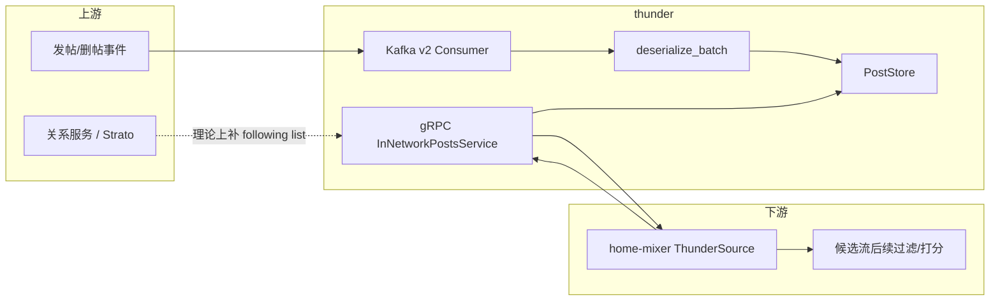
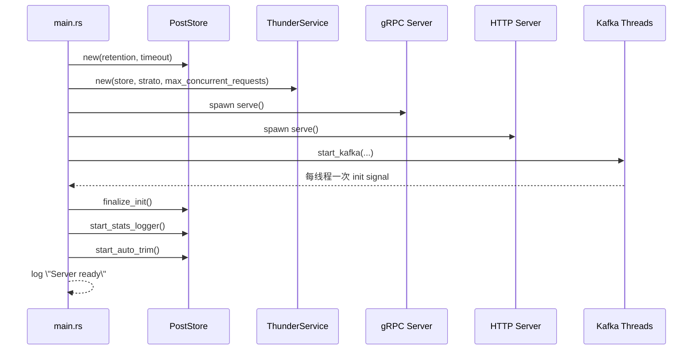
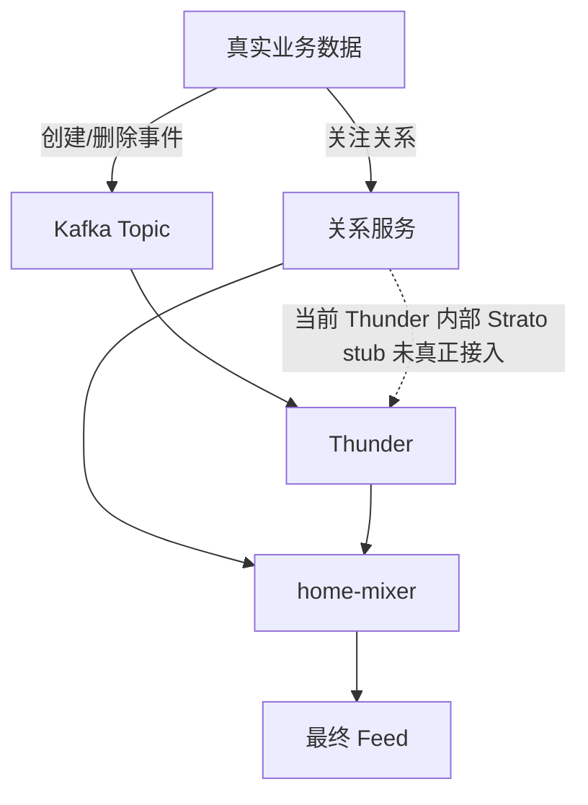

# 01 系统总览

## 1. Thunder 的职责

Thunder 在这套仓库里的定位非常清晰：它是网络内实时召回服务。

它负责的事情：

- 消费帖子创建/删除事件
- 在内存中按作者维护最近帖子索引
- 根据“请求用户关注了哪些作者”快速取回候选帖子
- 对帖子做轻量过滤和时间倒排
- 通过 gRPC 向 `home-mixer` 暴露查询接口

它不负责的事情：

- 不负责关系图构建，关注列表理论上来自 Strato/Redis/关系服务
- 不负责复杂排序与多目标预测
- 不负责内容实体补全、可见性判断、作者画像计算
- 不负责持久化数据库写入

## 2. 运行时组件

| 组件 | 当前实现 | 作用 |
|---|---|---|
| `main.rs` | 已实现 | 服务入口，负责组装依赖并启动线程/端口 |
| Kafka v2 消费器 | 已实现 | 从 `in-network-events` 读取 `InNetworkEvent` |
| `demo_seed.rs` | 已实现 | 演示模式数据源：`--demo-seed-posts N` 时生成模拟帖子灌入内存，替代 Kafka |
| `PostStore` | 已实现 | 内存中的帖子索引与删除墓碑集合 |
| `ThunderServiceImpl` | 已实现 | gRPC 查询入口 |
| `StratoClient` | stub | 按设计用于补齐 following list，当前总返回空 |
| HTTP 服务 | 空 Router | 名义上用于 health/metrics，当前没有真正路由 |
| Home Mixer 客户端 | 已实现 | 在 `ThunderSource` 中构造查询请求并消费响应 |

## 3. 端到端系统图

这张图里最关键的判断是：Thunder 的中心不是 gRPC，而是 `PostStore`。Kafka 写路径和查询读路径最终都收敛到这一个内存索引层。

## 4. 启动顺序

`main.rs` 的启动顺序如下：

1. 解析 CLI 参数。
2. 创建 `PostStore`。
3. 创建 `StratoClient`。
4. 创建 `ThunderServiceImpl`。
5. 立即启动 gRPC server。
6. 立即启动 HTTP server。
7. 根据运行模式二选一：
   - **演示模式**（`--demo-seed-posts N > 0`）：调用 `demo_seed::generate_demo_posts` 生成 N 条模拟帖子直接灌入 `PostStore`，不启动 Kafka。用于没有 Kafka 环境时快速跑通链路（作者固定为 101~105，与 home-mixer 演示模式的关注列表一致）。
   - **正常模式**：启动 Kafka 消费线程；在 `is_serving=true` 时，等待每个 Kafka 线程发送一次初始化信号（每线程需先消费满一个 batch，默认 1000 条）。
8. 调用 `post_store.finalize_init()`，随后开启统计日志和自动裁剪。
9. 打印 `Server ready`。

> 注意：正常模式下如果没有可用的 Kafka（或消息量不足一个 batch），启动会一直停在等待初始化信号，这是"没有 Kafka 就起不来"的根因。本地演示请用 `--demo-seed-posts`。

## 5. 一个很重要的实现事实

虽然 `Server ready` 日志在初始化收尾之后才打印，但 gRPC 和 HTTP 监听其实更早就已经启动了。也就是说：

- 端口先开始接受连接；
- 数据追平和 `finalize_init()` 在后面；
- 当前没有 readiness gate 阻止“数据未热好时的请求”进入。

这意味着 Thunder 当前的“可接入”与“已准备好”并不是同一个时刻。

## 6. 协议面

Thunder 对外依赖两个协议层对象：

| 消息/接口 | 作用 |
|---|---|
| `LightPost` | 内存中与 RPC 响应里使用的轻量帖子结构 |
| `InNetworkEvent` | Kafka v2 管道里的创建/删除统一封装 |
| `GetInNetworkPostsRequest` | 查询请求 |
| `GetInNetworkPostsResponse` | 查询响应 |
| `InNetworkPostsService/GetInNetworkPosts` | Thunder 唯一公开 RPC |

## 7. 当前系统边界

这就是当前仓库下 Thunder 的真实系统边界：它依赖外部把关系数据提前准备好，最实际的接入方式是由 `home-mixer` 在请求里直接带 `following_user_ids`。

## 8. 这一层需要记住的核心结论

- Thunder 是“实时缓存查询层”，不是排序层。
- 它的主要复杂度不在 RPC，而在“如何把事件维护成适合查询的内存结构”。
- 当前代码在主干流程上可运行，但 readiness、关系补齐、HTTP 观测面、初始化语义都还不完整。
