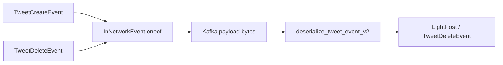
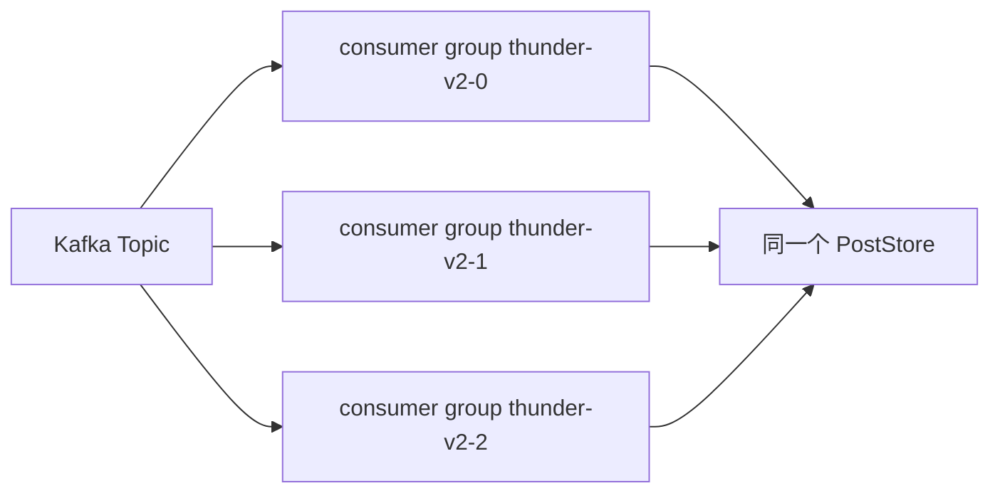
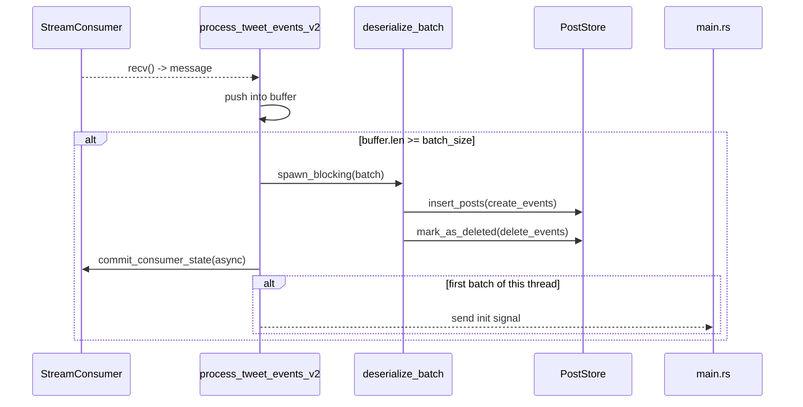
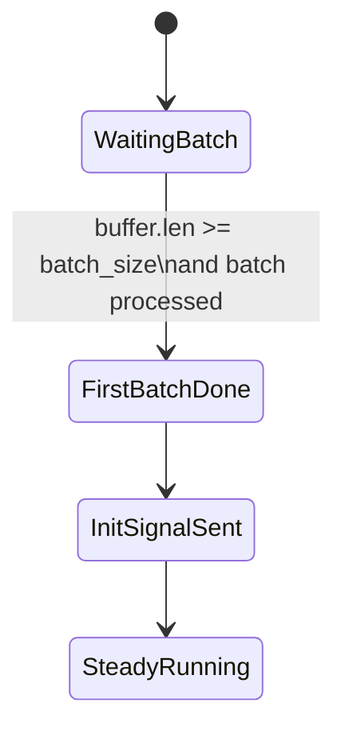

# 02 Kafka 摄入链路

## 1. 当前只看 v2 管道

`thunder` 默认只走 v2 管道：

- Topic: `in-network-events`
- 编码: Protobuf
- 事件包裹: `InNetworkEvent`
- 事件类型:
  - `TweetCreateEvent`
  - `TweetDeleteEvent`

legacy v1 文件还在仓库里，但默认不参与当前运行链路。

## 2. v2 事件模型



v2 的好处是语义非常直接：消费端不需要先做复杂 Thrift 解码和字段投影，直接从 `InNetworkEvent` 还原到 Thunder 自己使用的轻量对象。

## 3. 线程模型

代码会按 `kafka_num_threads` 启动多个 Tokio 任务，每个任务内部各自创建一个 `StreamConsumer`。

```mermaid
flowchart TD
    A[start_tweet_event_processing_v2] --> B[for thread_id in 0..kafka_num_threads]
    B --> C[group.id = {base}-v2-{thread_id}]
    C --> D[create StreamConsumer]
    D --> E[subscribe in-network-events]
    E --> F[process_tweet_events_v2 loop]
```

这里有一个必须明确写出来的事实：

- 当前每个线程都使用不同的 `group.id`
- 这不是“同一消费者组内分片消费”
- 而是“多个独立消费者组各自完整消费同一 topic”

也就是说，当前实现不是把分区分给多个线程，而是把整条流重复消费多次，只是依靠 `PostStore.posts.insert(post_id, ...)` 的去重避免重复写入最终状态。

## 4. 当前线程拓扑的真实语义



这会带来几个直接后果：

- Kafka 流量、反序列化 CPU 和批处理开销按线程数重复
- 删除事件会重复打 tombstone
- 初始化信号会被每个独立组各自触发一次
- “多线程”并没有换来真正的 topic 水平扩展

## 5. 批处理循环

单个消费者线程的主循环非常简单：

1. `recv()` 取一条消息。
2. 把 payload 放入 `message_buffer`。
3. 当缓冲条数达到 `kafka_batch_size` 时：
   - 取出整个 batch
   - `spawn_blocking` 反序列化
   - 把创建事件写入 `insert_posts`
   - 把删除事件写入 `mark_as_deleted`
   - 异步提交 offset
   - 若这是该线程第一次处理完 batch，则发送一次 init signal



## 6. 事件归一化逻辑

`deserialize_batch()` 做了两件关键事：

- 创建事件直接转成 `LightPost`
- `is_reply` 会被重新归一化为：
  - 原始 `create_event.is_reply`
  - 或 `in_reply_to_post_id` 存在
  - 或 `in_reply_to_user_id` 存在

这个处理的意义是：上游即使 reply 布尔位不可靠，只要 reply 相关字段存在，Thunder 仍会把它归入 reply 语义。

## 7. 错误处理策略

当前 Kafka 链路的错误处理偏“可继续跑”，不偏“严格失败”：

| 场景 | 当前处理 |
|---|---|
| 单条消息反序列化失败 | 记录日志、递增 `KAFKA_MESSAGES_FAILED_PARSE`、丢弃该消息 |
| `recv()` 失败 | `warn`、递增 `KAFKA_POLL_ERRORS`、sleep 100ms 后重试 |
| batch 反序列化失败 | `warn`，该 batch 不写入 `PostStore` |
| 提交 offset 失败 | `warn`，继续下一轮 |
| 整个消费任务返回错误 | `panic!`，认为线程异常退出是严重故障 |

## 8. 初始化语义

`main.rs` 会等待每个 Kafka 线程各发来一次信号，再执行 `finalize_init()`。

但当前实现里，这个信号的触发条件不是“线程已经追平 Kafka”，而是：

- 该线程第一次成功处理完一个满批次 batch。



这带来的问题是：

- 如果历史 backlog 很大，线程处理完首个 batch 就会发 init signal，明显早于真正 catch up
- 如果启动时消息量不足一个 batch，线程永远不发 signal，主线程会一直卡在等待阶段

所以“Kafka init”这个名字，在当前实现里更接近“每线程至少成功处理过一个 batch”。

## 9. 配置项与当前实现的偏差

下面这些参数在 `args.rs` 中暴露了，但 v2 管道里没有真正用上，或者用法与参数名不一致：

| 参数 | 当前状态 |
|---|---|
| `fetch_timeout_ms` | 未使用 |
| `skip_to_latest` | 未使用 |
| `kafka_tweet_events_v2_num_partitions` | 未使用 |
| `in_network_events_consumer_dest` | 未使用 |
| `lag_monitor_interval_secs` | 未使用，v2 没有 lag monitor |
| `sasl_mechanism` / `sasl_username` / `sasl_password` | v2 没用，反而用了 producer 侧 SASL 参数 |

## 10. 这一层要记住的核心结论

- v2 链路已经足够简单直接，但线程模型现在是“重复消费”而不是“分片并行”。
- 初始化信号不是严格 catch up 信号。
- 只有满 batch 才会落库，这会影响低流量场景的及时性和启动行为。
- Kafka 链路的主要优点是主干清晰，主要缺点是运行语义还不够严谨。
