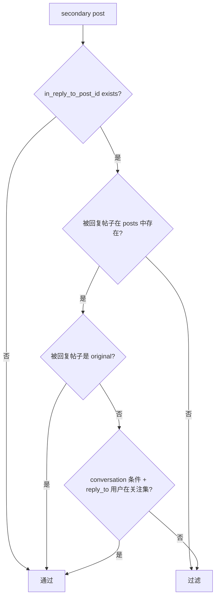

# 03 PostStore 内存索引

## 1. PostStore 是 Thunder 的核心

Thunder 的 Kafka 和 gRPC 只是两条 I/O 边，真正承载系统语义的是 `PostStore`。

它把帖子维护成五类状态：

- `posts`: `post_id -> LightPost`
- `original_posts_by_user`: `author_id -> VecDeque<TinyPost>`
- `secondary_posts_by_user`: `author_id -> VecDeque<TinyPost>`
- `video_posts_by_user`: `author_id -> VecDeque<TinyPost>`
- `deleted_posts`: `post_id -> tombstone`

## 2. 数据结构关系图

```mermaid
flowchart TD
    P[posts: post_id -> LightPost]
    O[original_posts_by_user]
    S[secondary_posts_by_user]
    V[video_posts_by_user]
    D[deleted_posts]

    O --> T1[TinyPost(post_id, created_at)]
    S --> T2[TinyPost(post_id, created_at)]
    V --> T3[TinyPost(post_id, created_at)]

    T1 --> P
    T2 --> P
    T3 --> P
    D -. 查询时过滤 / finalize_init 再清理 .-> P
```

`TinyPost` 只保存 `post_id` 和 `created_at`，真正返回给 RPC 的内容仍然从 `posts` 里拿 `LightPost`。

## 3. 为什么要分三条用户时间线

按作者拆成三条索引，不是为了表达业务分类本身，而是为了让查询时能分别应用不同上限和过滤策略：

| 索引 | 内容 | 用途 |
|---|---|---|
| `original_posts_by_user` | 非 reply、非 retweet | 主召回来源 |
| `secondary_posts_by_user` | reply + retweet | 补充候选，但过滤更严格 |
| `video_posts_by_user` | 可作为视频候选的帖子 | 支持 `is_video_request=true` |

## 4. 插入路径

写入时的关键步骤如下：

1. 过滤掉未来时间帖子。
2. 过滤掉超过保留期的旧帖子。
3. 按 `created_at` 升序排序本批次。
4. 若 `deleted_posts` 已存在该 `post_id`，跳过。
5. 插入 `posts`。
6. 如果此前已存在同 `post_id`，认为是重复事件，停止后续索引写入。
7. 根据 `is_reply` / `is_retweet` 写入 original 或 secondary。
8. 计算 `video_eligible`，必要时写入 video timeline。

```mermaid
flowchart TD
    A[batch of LightPost] --> B[按保留时间过滤]
    B --> C[按 created_at 升序排序]
    C --> D{deleted_posts\n已存在?}
    D -- 是 --> X[跳过]
    D -- 否 --> E[posts.insert(post_id, post)]
    E --> F{old.is_some?}
    F -- 是 --> X
    F -- 否 --> G{original?}
    G -- 是 --> H[push original_posts_by_user]
    G -- 否 --> I[push secondary_posts_by_user]
    H --> J[计算 video_eligible]
    I --> J
    J --> K{可进 video timeline?}
    K -- 是 --> L[push video_posts_by_user]
    K -- 否 --> X
```

## 5. 视频资格如何判定

当前实现下，视频资格规则是：

- 普通帖子：直接看 `post.has_video`
- retweet：
  - 先看自己是否 `has_video`
  - 如果没有，再尝试从 `source_post_id` 找原帖
  - 只有原帖存在、不是 reply、且 `has_video=true` 时，retweet 才算视频候选
- reply 永远不进入 `video_posts_by_user`

这里有个实现副作用：retweet 的视频资格只在插入当下计算一次，不会在源帖后来补到 `posts` 后重新回填。

## 6. 删除路径

删除事件的处理不是“从所有索引里立即彻底剔除”，而是“先打墓碑，再懒清理”：

1. 从 `posts` 删除 full doc。
2. 在 `deleted_posts` 写 tombstone。
3. 把一个 `TinyPost(post_id, deleted_at)` 追加到 `original_posts_by_user[DELETE_EVENT_KEY]`。

`DELETE_EVENT_KEY=-1` 的这条伪用户时间线，实际上是为了让删除墓碑也能参与统一的保留期裁剪。

```mermaid
flowchart LR
    A[TweetDeleteEvent] --> B[posts.remove(post_id)]
    B --> C[deleted_posts.insert(post_id)]
    C --> D[original_posts_by_user[-1].push_back(TinyPost deleted_at)]
    D --> E[后续 trim_old_posts 按保留期移除 tombstone]
```

这套设计解决了两个问题：

- 创建/删除事件乱序到达时，删除结果仍然能压过创建事件
- tombstone 不会无限期保留，而是跟着 retention 一起老化

## 7. finalize_init 的作用

`finalize_init()` 做三件事：

1. 把每个用户的 `VecDeque<TinyPost>` 按时间升序排好。
2. 先跑一遍 `trim_old_posts()`。
3. 再遍历 `deleted_posts`，把对应的 `posts` 条目强行删除一次。

这一步的核心目的是弥补“上游 feeder 可能丢失 create/delete 顺序”的问题。

## 8. 查询时怎么扫描

`get_all_posts_by_users()` 分两段执行：

- original 阶段：从 `original_posts_by_user` 取
- secondary 阶段：从 `secondary_posts_by_user` 取

每段都调用同一个底层函数 `get_posts_from_map()`。

对单个作者的扫描逻辑是：

1. 从时间线尾部开始倒序遍历，优先看最新帖子。
2. 先过滤 `exclude_tweet_ids`。
3. 单作者最多扫描 `MAX_TINY_POSTS_PER_USER_SCAN=500` 条。
4. 通过 `post_id` 回表到 `posts`。
5. 过滤掉已删除帖子。
6. 过滤掉“转发了请求用户自己内容”的 retweet。
7. 如果这是 secondary 阶段，再套 reply/retweet 过滤规则。
8. 单作者本次查询最多返回（不是存储上限）：
   - original 200 条
   - secondary 50 条
   - video 50 条

original 与 secondary 共用同一次 `start_time`。默认扫描超时 500ms（`--request-timeout-ms`）用完后，secondary 可能整段为空。

## 9. secondary 过滤规则

secondary 阶段不是简单把所有 reply/retweet 全放出来，而是做了额外约束：

- retweet 因为通常没有 `in_reply_to_post_id`，会直接通过 secondary 过滤
- reply 只有在以下情况之一才通过：
  - 回复的是一个 original post
  - 或回复的是某个 reply/retweet，但该 replied-to post 的 `in_reply_to_post_id` 等于当前帖子的 `conversation_id`，同时 `in_reply_to_user_id` 属于 following set



这一段逻辑的目的，是尽量保留网络内对话线程里的有价值回复，同时避免把过深、过散的次级回复大量带入召回。

## 10. 超时与部分结果

`get_posts_from_map()` 会拿请求开始时间与 `request_timeout` 比较：

- 一旦超时，就停止继续扫描后续作者
- 已经收集到的结果不会丢弃，而是直接作为部分结果返回

这意味着 Thunder 的超时语义不是“整请求失败”，而是“扫描中止，返回已经找到的候选”。默认 `--request-timeout-ms 500`。original 与 secondary 共用同一次时钟，不是每阶段单独 500ms。

## 11. 自动裁剪

`trim_old_posts()` 会遍历 original、secondary、video 三张 timeline，把队头超过 retention 的帖子弹出。

几个关键细节：

- 裁剪判断基于 `TinyPost.created_at`
- original / secondary / video 裁剪走同一闭包，都会同步 `posts.remove(post_id)`（video 裁剪时该帖通常已被原路径删过）
- `trim_old_posts` 返回值不含 video deque 弹出次数；auto-trim 日志会对不上视频表
- 间隔硬编码 2 分钟，无 CLI
- 处理 `DELETE_EVENT_KEY` 时，还会顺手删除对应 tombstone
- 如果某个作者时间线空了，会把该作者键一起删掉

## 12. 这层结构解决了什么问题

| 问题 | 当前处理 |
|---|---|
| 同一帖子重复创建事件 | `posts.insert` 返回旧值后跳过重复索引 |
| 创建/删除乱序 | `deleted_posts` tombstone + `finalize_init()` 二次清理 |
| 删除后仍有时间线引用 | 查询时回表失败或命中 tombstone 被过滤，后续 trim 清掉悬挂引用 |
| 大关注集扫描过慢 | 请求级 timeout + 单作者扫描上限 |
| 视频召回和普通召回分离 | 单独维护 `video_posts_by_user` |

## 13. 当前实现的主要副作用

- 删除不会立即从所有作者时间线中物理移除，只是逻辑删除。
- `clear()` 没有清空 `deleted_posts`，如果以后真的调用，墓碑会残留。
- 统计日志里的 `user_count` 只看 `original_posts_by_user.len()`，不代表全部作者键数量。
- video timeline 是派生索引，但不是强一致重算索引，retweet 视频资格不会被事后修正。

## 14. 这一层要记住的核心结论

- `PostStore` 不是一个简单哈希表，而是“full doc + 多条按作者组织的轻索引 + tombstone”的组合。
- 读性能的关键来自“先按作者时间线扫 TinyPost，再回表到 LightPost”。
- 这套结构优先保证查询快和乱序容忍，接受一定程度的懒清理和派生索引不完全一致。
