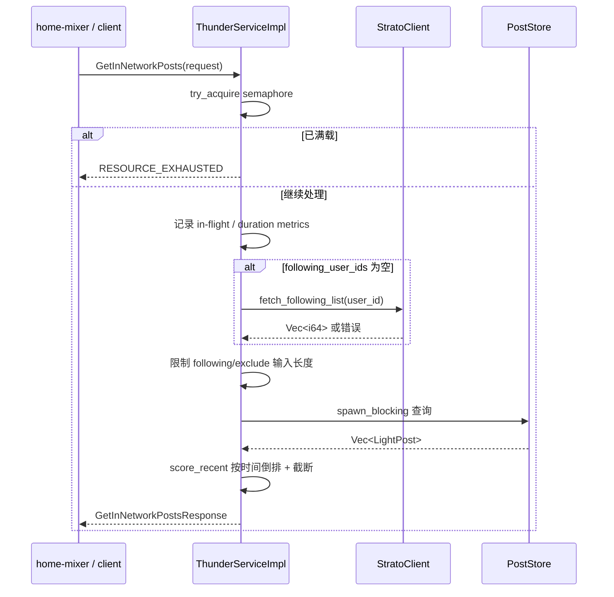
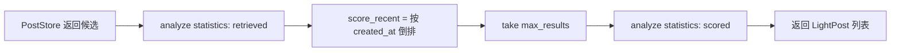
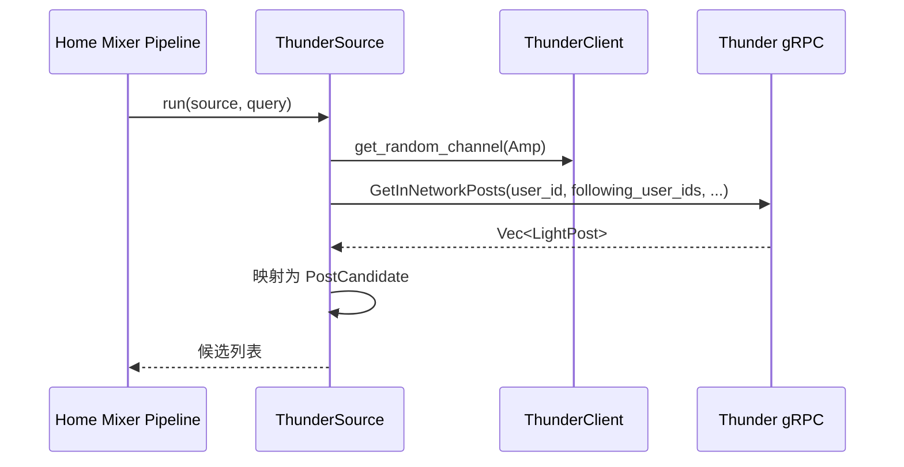

# 04 查询服务链路

## 1. Thunder 对外只暴露一个 RPC

Thunder 当前对外只有一个接口：

- Service: `InNetworkPostsService`
- Method: `GetInNetworkPosts`

它的请求/响应都很轻量，设计目标是让调用方尽快拿到网络内候选，而不是在 Thunder 里做复杂业务判断。

## 2. 请求字段与当前行为

| 字段 | 当前行为 |
|---|---|
| `user_id` | 用于过滤“转发了请求用户自己内容”的 retweet，也用于必要时查 following list |
| `following_user_ids` | 最关键输入，决定要从哪些作者的时间线里取帖 |
| `max_results` | 为 0 时使用默认值：普通请求 1000，视频请求 200。当前 `ThunderSource` 恒传 `THUNDER_MAX_RESULTS=1200`，Thunder 按请求值截断，不会再压回 1000 |
| `exclude_tweet_ids` | 查询前先转成 `HashSet`，用于排除已曝光帖子 |
| `algorithm` | 当前未使用 |
| `debug` | 仅控制请求日志；不影响数据查询语义 |
| `is_video_request` | 选择走 `get_videos_by_users()` 还是 `get_all_posts_by_users()` |

`user_id`、`following_user_ids` 和 `exclude_tweet_ids` 会在进入内存存储前校验是否能表示为有符号 64 位 ID；超出范围的请求直接返回 `INVALID_ARGUMENT`，避免整数溢出造成错误匹配。

## 3. 请求处理总流程

## 4. 并发与过载保护

`ThunderServiceImpl` 在入口就做了非常明确的容量控制：

- 使用 `Semaphore`
- 用 `try_acquire()` 而不是等待
- 没拿到 permit 就立刻返回 `RESOURCE_EXHAUSTED`

这意味着 Thunder 的过载策略不是“排队”，而是“快速失败，让上游重试或降级”。

优点：

- 不会在负载高时把请求堆在服务内部
- 延迟尾部更可控

代价：

- 调用方必须能接受瞬时拒绝
- 没有内建排队或自适应退避

## 5. Strato fallback 的真实语义

当请求没有带 `following_user_ids` 时，Thunder 会调用 `StratoClient` 获取关注列表；`debug` 只控制日志，不会改变这一回退条件。

`StratoClient` 当前仍是 stub，始终返回空列表，因此这条路径暂时只是接入点，不能替代真实关系服务。生产接入时应替换该实现，并为失败配置明确的超时与降级策略。

## 6. 查询阶段真正做了哪些过滤

Thunder 不做模型打分，但会做几类轻过滤：

| 类型 | 位置 | 作用 |
|---|---|---|
| 输入截断 | `thunder_service.rs` | `following_user_ids` 和 `exclude_tweet_ids` 最多各保留 5000 个 |
| 已曝光过滤 | `PostStore` | 命中 `exclude_tweet_ids` 的帖子直接跳过 |
| 已删除过滤 | `PostStore` | 回表失败或命中 `deleted_posts` 时过滤 |
| 自己内容 retweet 过滤 | `PostStore` | `post.is_retweet && source_user_id == request_user_id` 时过滤 |
| secondary reply 过滤 | `PostStore` | 只保留满足对话条件的 reply |
| 请求超时截断 | `PostStore` | 超时后停止扫描更多作者，返回部分结果 |

## 7. 排序和“打分”

Thunder 当前所谓的 `score_recent()` 实际只有一件事：

- 按 `created_at` 倒序排序
- 然后截断到 `max_results`

这意味着：

- Thunder 返回的是“最新候选”
- 不是“最相关候选”
- 也不产出数值 score 字段

如果上层想做真正排序，必须交给 `home-mixer` 或后续打分组件。

## 8. Home Mixer 如何调用 Thunder

`home-mixer/sources/thunder_source.rs` 当前的调用方式非常直接：

- `has_cached_posts=true` 时 `ThunderSource.enable()` 为 false，根本不打 Thunder
- 否则显式把 `query.user_features.followed_user_ids` 传给 Thunder，`max_results=1200`
- `debug=false`
- `exclude_tweet_ids=query.seen_ids`
- `is_video_request=false`
- `algorithm="default"`
- Home Mixer 对 RPC 设置 500 ms timeout；Thunder 扫描也默认 `--request-timeout-ms 500`，两端在抢同一预算。超时/Status 错误作为 Source 错误记录，由 Candidate Pipeline 保留其他来源候选

ThunderSource 从响应里只提取了几类结构化信息：

- `tweet_id`
- `author_id`
- `in_reply_to_tweet_id`
- `retweeted_tweet_id` / `retweeted_user_id`
- `ancestors`
- `served_type=ForYouInNetwork`；`in_network_only` 请求使用 `RankedFollowing`

Thunder wire 的 `LightPost` ID 仍为 signed `int64`。Home Mixer adapter 使用 checked conversion，并丢弃 post/author ID 为负数或 0 的记录；可选 reply/conversation/retweet ID 非法时只忽略对应关系字段，不会把负数静默转成大整数。

也就是说，Thunder 在整个推荐链路里承担的是“候选提供者”，不是“最终排序者”。

## 9. 默认端口与 readiness

Thunder CLI 和 Home Mixer `ThunderClient` 的默认 gRPC 端口现在统一为 `50052`；仍可分别用 `--grpc-port` 和 `THUNDER_GRPC_ADDR` 显式覆盖。

监听端口只说明 transport 已绑定。Demo 脚本还会等待 Thunder 日志中的 `Server ready`，确保 demo seed 已写入并完成 `PostStore::finalize_init()` 后才启动 Home Mixer 请求。

## 10. 当前响应语义

Thunder 返回的 `LightPost` 有几个很重要的边界：

- 只包含轻量字段，不包含完整实体信息
- 时间已经是全局倒排后的结果
- 未暴露显式 score
- 可能是部分结果，因为 `PostStore` 查询超时不会直接报错

## 11. 这一层要记住的核心结论

- Thunder 查询路径的本质是“容量保护 + 输入整理 + PostStore 读取 + 时间倒排”。
- 它是一个快、轻、偏保守的召回接口，不是一个智能排序接口。
- 当前最需要警惕的是 fallback 语义和“部分结果但不报错”的行为边界；Home Mixer 端另有 500 ms 总调用上限。
