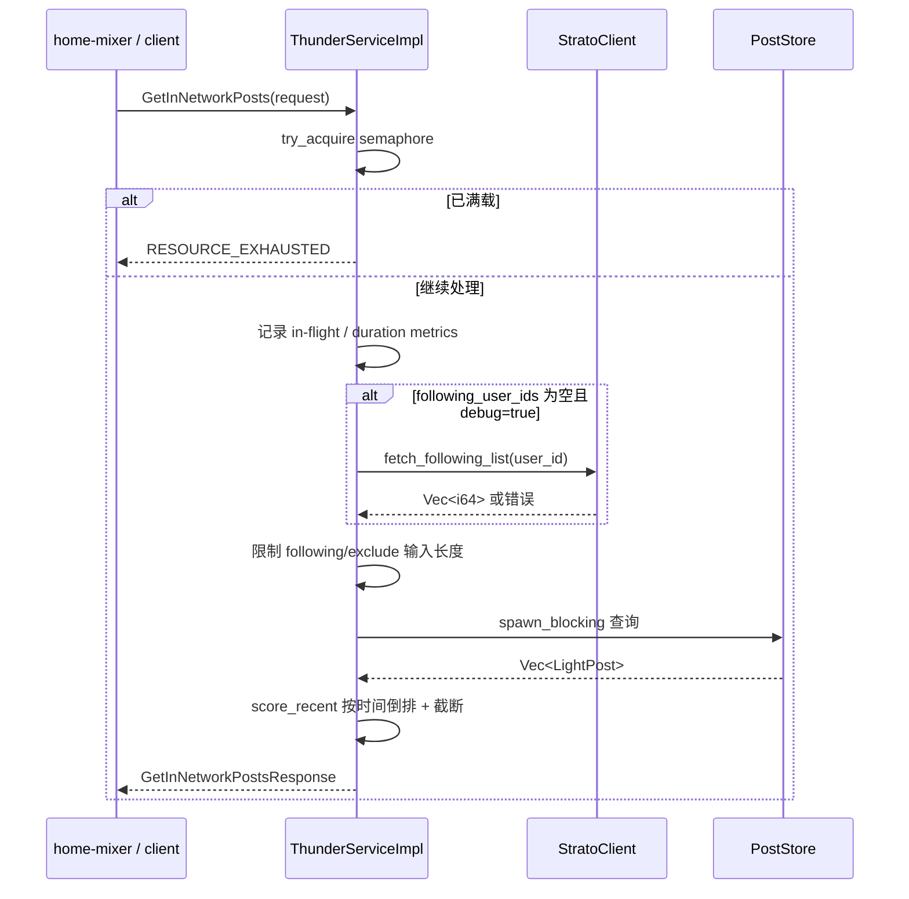
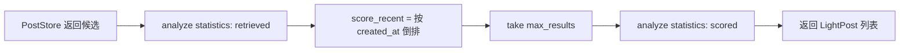
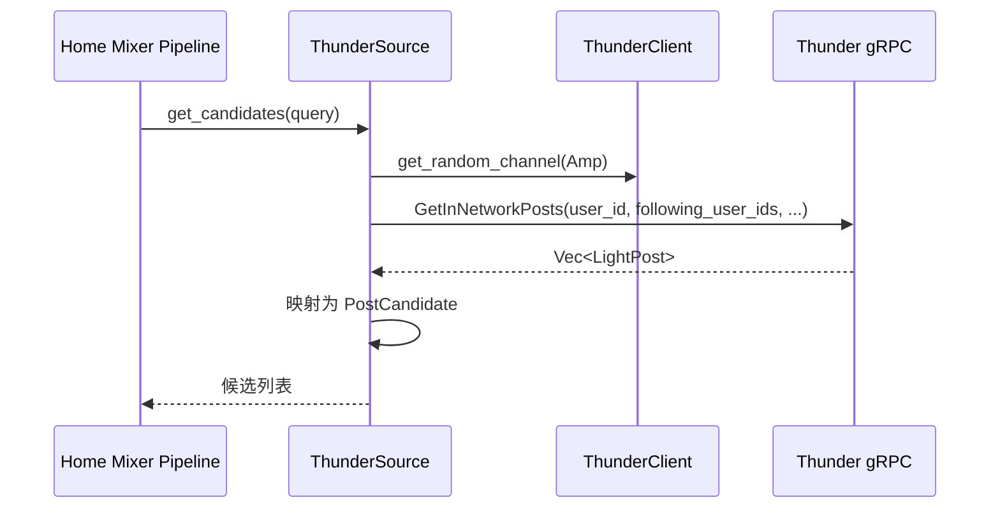

# 04 查询服务链路

## 1. Thunder 对外只暴露一个 RPC

Thunder 当前对外只有一个接口：

- Service: `InNetworkPostsService`
- Method: `GetInNetworkPosts`

它的请求/响应都很轻量，设计目标是让调用方尽快拿到网络内候选，而不是在 Thunder 里做复杂业务判断。

## 2. 请求字段与当前行为

| 字段 | 当前行为 |
|---|---|
| `user_id` | 用于过滤“转发了请求用户自己内容”的 retweet，也用于必要时查 following list |
| `following_user_ids` | 最关键输入，决定要从哪些作者的时间线里取帖 |
| `max_results` | 为 0 时使用默认值：普通请求 1000，视频请求 200 |
| `exclude_tweet_ids` | 查询前先转成 `HashSet`，用于排除已曝光帖子 |
| `algorithm` | 当前未使用 |
| `debug` | 控制日志；并且当前实现里还意外影响了 Strato fallback 是否触发 |
| `is_video_request` | 选择走 `get_videos_by_users()` 还是 `get_all_posts_by_users()` |

## 3. 请求处理总流程

## 4. 并发与过载保护

`ThunderServiceImpl` 在入口就做了非常明确的容量控制：

- 使用 `Semaphore`
- 用 `try_acquire()` 而不是等待
- 没拿到 permit 就立刻返回 `RESOURCE_EXHAUSTED`

这意味着 Thunder 的过载策略不是“排队”，而是“快速失败，让上游重试或降级”。

优点：

- 不会在负载高时把请求堆在服务内部
- 延迟尾部更可控

代价：

- 调用方必须能接受瞬时拒绝
- 没有内建排队或自适应退避

## 5. Strato fallback 的真实语义

代码注释写的是：

- 如果请求没有带 `following_user_ids`，就从 Strato 拉。

但当前实现的真实条件是：

- `following_user_ids.is_empty() && req.debug`

也就是说：

- `debug=false` 且 following 为空时，不会去查 Strato
- 只有 debug 打开时，才走 fallback

再加上 `StratoClient` 本身当前总是返回空列表，所以这条路径现在更像“调试占位逻辑”，不是一个可依赖的生产能力。

## 6. 查询阶段真正做了哪些过滤

Thunder 不做模型打分，但会做几类轻过滤：

| 类型 | 位置 | 作用 |
|---|---|---|
| 输入截断 | `thunder_service.rs` | `following_user_ids` 和 `exclude_tweet_ids` 最多各保留 5000 个 |
| 已曝光过滤 | `PostStore` | 命中 `exclude_tweet_ids` 的帖子直接跳过 |
| 已删除过滤 | `PostStore` | 回表失败或命中 `deleted_posts` 时过滤 |
| 自己内容 retweet 过滤 | `PostStore` | `post.is_retweet && source_user_id == request_user_id` 时过滤 |
| secondary reply 过滤 | `PostStore` | 只保留满足对话条件的 reply |
| 请求超时截断 | `PostStore` | 超时后停止扫描更多作者，返回部分结果 |

## 7. 排序和“打分”

Thunder 当前所谓的 `score_recent()` 实际只有一件事：

- 按 `created_at` 倒序排序
- 然后截断到 `max_results`

这意味着：

- Thunder 返回的是“最新候选”
- 不是“最相关候选”
- 也不产出数值 score 字段

如果上层想做真正排序，必须交给 `home-mixer` 或后续打分组件。

## 8. Home Mixer 如何调用 Thunder

`home-mixer/sources/thunder_source.rs` 当前的调用方式非常直接：

- 总是显式把 `query.user_features.followed_user_ids` 传给 Thunder
- `debug=false`
- `exclude_tweet_ids=[]`
- `is_video_request=false`
- `algorithm="default"`

ThunderSource 从响应里只提取了几类结构化信息：

- `tweet_id`
- `author_id`
- `in_reply_to_tweet_id`
- `ancestors`
- `served_type=ForYouInNetwork`

也就是说，Thunder 在整个推荐链路里承担的是“候选提供者”，不是“最终排序者”。

## 9. 一个必须单独指出的集成问题

默认端口目前不一致：

| 位置 | 默认值 |
|---|---|
| `thunder/args.rs` 中 `grpc_port` | `50051` |
| `home-mixer/clients/thunder_client.rs` 默认地址 | `http://localhost:50052` |

如果不通过环境变量 `THUNDER_GRPC_ADDR` 显式覆盖，两个模块默认情况下是对不上的。

## 10. 当前响应语义

Thunder 返回的 `LightPost` 有几个很重要的边界：

- 只包含轻量字段，不包含完整实体信息
- 时间已经是全局倒排后的结果
- 未暴露显式 score
- 可能是部分结果，因为 `PostStore` 查询超时不会直接报错

## 11. 这一层要记住的核心结论

- Thunder 查询路径的本质是“容量保护 + 输入整理 + PostStore 读取 + 时间倒排”。
- 它是一个快、轻、偏保守的召回接口，不是一个智能排序接口。
- 当前最需要警惕的不是 RPC 复杂度，而是 fallback 语义、默认端口和“部分结果但不报错”的行为边界。
