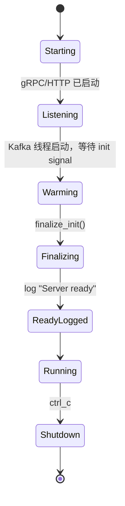
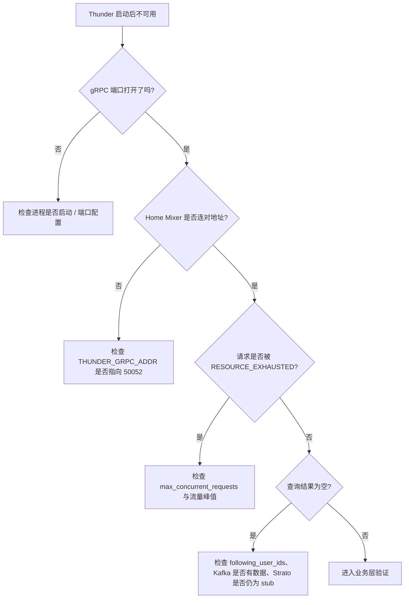

# 05 运维与可观测性

## 1. 对外暴露面

Thunder 当前运行时会启动两个监听端口：

| 端口 | 默认值 | 当前状态 |
|---|---|---|
| gRPC | `50052` | 真正提供 `GetInNetworkPosts` |
| HTTP | `8080` | 只启动空 `Router`，没有实际路由 |

所以当前对外的真实情况是：

- gRPC 可用
- HTTP 只是“端口开着”，不是“观测面完整”

## 2. 启动后的运行状态

注意这张图里 `Listening` 早于 `ReadyLogged`。因此部署层如果需要 readiness 语义，不能只看“端口是否打开”。

## 3. 已定义的监控指标

Thunder 的指标定义相对完整，分为三组：

| 指标组 | 示例 | 当前含义 |
|---|---|---|
| gRPC 请求 | `thunder_get_in_network_posts_duration_seconds` | 请求总延迟 |
| PostStore | `thunder_post_store_total_posts` | 内存中帖子数量 |
| Kafka | `thunder_kafka_poll_errors_total` | Kafka 轮询错误累计 |

比较有价值的几个指标：

- `thunder_in_flight_requests`
- `thunder_rejected_requests_total`
- `thunder_get_in_network_posts_found_freshness_seconds{stage=...}`
- `thunder_post_store_deleted_posts`
- `thunder_post_store_request_timeouts_total`
- `thunder_kafka_messages_failed_parse_total`

## 4. 观测面现状与缺口

| 能力 | 当前状态 | 说明 |
|---|---|---|
| Prometheus 指标定义 | 有 | `metrics.rs` 已注册多组指标 |
| HTTP 指标暴露 | 没有 | HTTP Router 为空，没有 `/metrics` |
| health / readiness 路由 | 没有 | 没有 `/healthz`、`/readyz` |
| gRPC reflection | 没有 | Thunder 没有像 Home Mixer 那样注册 reflection service |
| Kafka lag 监控 | v2 没有 | lag 指标定义了，但 v2 消费器并未更新它 |
| shutdown 协调 | 不完整 | 创建了 `CancellationToken`，但没有传入后台任务 |

## 5. 可观测性最大的误区

定义指标不等于已经可观测。

Thunder 当前就是一个典型例子：

- 代码里有 `prometheus` 指标
- 但没有 HTTP 导出路由
- 所以外部 Prometheus 实际上抓不到这些指标

这意味着“埋点代码存在”和“运维系统能看到数据”之间还差一层接线。

## 6. 启动/排障检查图

## 7. 部署前检查项

| 检查项 | 为什么重要 |
|---|---|
| `THUNDER_GRPC_ADDR` 是否与 Thunder 端口一致 | 两边默认都是 `50052`；只在改过 `--grpc-port` 时才需要显式对齐 |
| Kafka topic 是否真叫 `in-network-events` | v2 代码里是硬编码订阅 |
| `kafka_batch_size` 是否适合流量规模 | 批太大时低流量会卡初始化和实时性 |
| `max_concurrent_requests` 是否足够 | Thunder 过载时会立刻拒绝而不是排队 |
| `post_retention_seconds` 是否与产品召回窗口匹配 | 决定缓存占用和候选时间范围 |
| 是否真的需要内部 Strato fallback | 当前既受 `debug` 控制，又是 stub |
| 是否补上 `/metrics` 与 `/readyz` | 否则只能看日志，无法做标准运维接入 |

## 8. 日志能帮你看到什么

当前日志比较适合回答以下问题：

- 进程是否已经启动 gRPC / HTTP
- Kafka 每线程是否至少处理过一个 batch
- `PostStore` 当前大概有多少用户/帖子/删除墓碑
- 请求是否因过载被拒绝
- 请求是否因为扫描超时只返回了部分结果

但日志不太适合回答：

- 当前 Kafka lag 到底是多少
- 当前延迟分位数是多少
- 某个时间段内 rejected rate 是否升高

因为这些信息虽然有指标定义，但没有真正暴露。

## 9. 当前运维姿势的本质

Thunder 现在更像“开发态/实验态服务”：

- 主链路已经在
- 参数也很多
- 指标定义也不少
- 但观测和 readiness 没有闭环

要把它升成更稳的服务，优先级不一定是继续加功能，而是先把 health、metrics、初始化语义和 shutdown 协调补完整。

## 10. 这一层要记住的核心结论

- Thunder 现在不是“没有观测”，而是“观测代码存在，但运维接入口未闭合”。
- 部署层最容易踩的是空 HTTP router、初始化时机误判和批大小设置不合理。默认 gRPC 端口已与 home-mixer 对齐为 `50052`。
- 只靠 `Server ready` 日志不能替代标准 readiness 检查。
