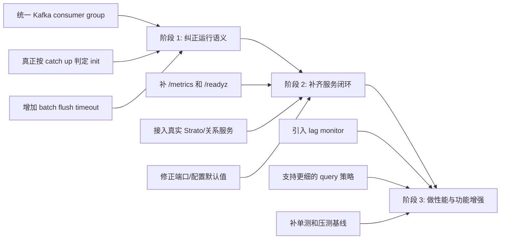

# 06 风险清单与改造路线

## 1. 最高优先级问题

下面这些不是“可以再优化”的普通事项，而是会直接影响运行语义或部署稳定性的点。

| 优先级 | 问题 | 当前事实 | 影响 |
|---|---|---|---|
| P0 | Kafka 多线程重复消费 | 每线程使用不同 `group.id` | Kafka 开销按线程数重复，初始化语义也被放大 |
| P0 | 初始化信号不等于 catch up | 每线程处理完首个满 batch 就发信号 | 可能在 backlog 还很大时就开始对外服务 |
| P0 | 小流量场景可能卡住初始化 | 只有满 `kafka_batch_size` 才处理 batch | 消息不足一个 batch 时永远不发 init signal |
| P1 | Following fallback 语义错误 | 只有 `following_user_ids` 为空且 `debug=true` 才查 Strato | 非调试请求缺少 following 时直接空查 |
| P1 | Strato 仍是 stub | `fetch_following_list()` 永远返回空 | Thunder 内部无法独立补齐关系图 |
| P1 | HTTP 观测面未接通 | 只有空 Router，没有 metrics/health | 指标抓不到，也没有 readiness |
| P1 | v2 SASL 参数用错 | v2 代码读取的是 producer 侧 SASL 配置 | 消费端认证配置容易失效 |
| P2 | 多个 CLI 参数未生效 | `skip_to_latest`、`fetch_timeout_ms` 等未使用 | 配置表面看可控，实际上无效 |
| P2 | shutdown 协调不完整 | `CancellationToken` 创建后未传入任务 | 后台任务退出依赖进程结束，不是优雅停机 |

## 2. 这些问题背后的共性

这些风险大体不是算法问题，而是“系统语义还没完全收拢”的问题：

- 名字上像能力，运行时却不是同一个意思
- 配置上像可控，代码里却没真正使用
- 结构上像生产服务，观测和 readiness 却还是空心的

## 3. 改造路线图

## 4. 阶段 1 应该先做什么

### 4.1 修正 Kafka 并行模型

目标应该是：

- 多个消费者共享同一个 `group.id`
- 让 Kafka 自己做分区分配
- 线程数对应“消费并行度”，而不是“重复消费份数”

### 4.2 修正 init 判定

当前的“首个满 batch 处理完成”不能代表 catch up。

更合理的方向：

- 基于分区 lag 归零
- 或明确区分 bootstrap 完成与 steady-state running
- 至少把命名改成与真实语义一致

### 4.3 给 batch 增加时间触发刷写

现在只有“数量达到阈值”才会处理 batch。

更稳的方式通常是双触发：

- 数量阈值
- 时间阈值

这样既保证吞吐，也不至于让低流量时的事件无限滞留。

## 5. 阶段 2 应该补哪些闭环

| 项目 | 目标状态 |
|---|---|
| `/metrics` | 真正导出 `prometheus` registry |
| `/readyz` | 至少反映 Kafka 初始化和依赖状态 |
| `StratoClient` | 接真实关系源，而不是返回空 |
| SASL 配置 | consumer 读 consumer 参数，producer 读 producer 参数 |

## 6. 阶段 3 才值得考虑的增强

这些是更像“优化”而不是“修正”：

- 为视频召回做更强的一致性派生索引
- 给 `GetInNetworkPosts` 补更多查询模式
- 增加更细粒度的 per-stage 指标和 tracing
- 补齐单测、回归测试、压测基线

## 7. 推荐的文档使用方式

如果你是：

- 要接入 Thunder 的调用方：先看 [04-query-serving.md](./04-query-serving.md) 和本篇
- 要修 Kafka 摄入的人：先看 [02-kafka-ingestion.md](./02-kafka-ingestion.md)
- 要改索引和查询规则的人：先看 [03-post-store.md](./03-post-store.md)
- 要把服务做成更稳定可部署的人：先看 [05-operations-and-observability.md](./05-operations-and-observability.md)

## 8. 最终判断

Thunder 当前已经有一个清晰、可解释、可演进的骨架：

- 方向对了
- 主路径在了
- 数据结构也不混乱

但它现在最需要的不是继续堆功能，而是把几个关键运行语义先拉直：

- Kafka 并行到底怎么并
- 初始化何时算完成
- 服务何时算 ready
- 关系数据到底由谁负责补齐

这四个问题答清楚以后，Thunder 才真正从“能跑”进入“能稳定接入和扩展”。
