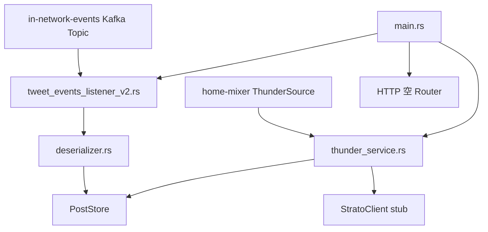

# thunder 文档索引

这组文档基于当前仓库里的 `thunder/` crate、`proto/definitions/in_network.proto` 以及 `home-mixer` 对 Thunder 的调用链整理。目标不是解释“实时召回系统通常怎么设计”，而是把这份代码现在真实在做什么、怎么做、哪里已经完成、哪里还是占位或存在实现缺口，说清楚。

## 结论先行

- `thunder` 当前是一个三段式系统：Kafka v2 消费 -> `PostStore` 内存索引 -> gRPC 查询服务。
- 查询阶段不做模型打分，也不做复杂排序，只做过滤、按时间倒排和截断。
- 系统已经具备“消费事件并对外查询”的主干，但还没有达到完整生产态：`StratoClient` 仍是 stub，HTTP 端口没有真正暴露 health/metrics，初始化“追平 Kafka”语义也还不严格。
- 文档会始终区分两件事：
  - 设计意图：Thunder 应该承担什么职责。
  - 当前实现：这份代码现在实际怎么运行。

## 推荐阅读顺序

1. [01-system-overview.md](./01-system-overview.md)
2. [02-kafka-ingestion.md](./02-kafka-ingestion.md)
3. [03-post-store.md](./03-post-store.md)
4. [04-query-serving.md](./04-query-serving.md)
5. [05-operations-and-observability.md](./05-operations-and-observability.md)
6. [06-risks-and-roadmap.md](./06-risks-and-roadmap.md)

## 覆盖范围

- `thunder/main.rs` 的启动顺序、初始化语义、服务边界
- `tweet_events_listener_v2.rs` 的 Kafka 消费模型、批处理与容错路径
- `posts/post_store.rs` 的内存数据结构、写入/删除/查询/裁剪逻辑
- `thunder_service.rs` 的 gRPC 请求处理、过滤规则、并发保护与响应语义
- 监控指标、部署关注点、当前实现缺口和建议改造路径

## 不重点展开的内容

- legacy v1 Thrift 管道的完整工作细节
- `home-mixer` 候选流框架内部执行细节
- 生产环境 Kafka/关系服务/缓存系统的具体部署方案

## 模块地图

## 核心源码定位

| 主题 | 主要文件 | 说明 |
|---|---|---|
| 启动入口 | `thunder/main.rs` | 创建 `PostStore`、启动 gRPC/HTTP、拉起 Kafka、等待初始化 |
| 参数与常量 | `thunder/args.rs`、`thunder/config.rs` | CLI 参数、保留时间、每作者上限、输入截断上限 |
| Kafka 管道 | `thunder/kafka_utils.rs`、`thunder/kafka/tweet_events_listener_v2.rs` | 消费 `InNetworkEvent`、批量反序列化、写入 `PostStore` |
| 存储核心 | `thunder/posts/post_store.rs` | 内存索引、删除墓碑、扫描查询、自动裁剪 |
| gRPC 服务 | `thunder/thunder_service.rs` | 并发控制、请求参数处理、查询与返回 |
| 协议 | `proto/definitions/in_network.proto` | `LightPost`、`InNetworkEvent`、`GetInNetworkPosts` |
| 调用方 | `home-mixer/sources/thunder_source.rs` | Home Mixer 如何构造请求并消费响应 |

## 读这组文档时的原则

- 先看系统职责，再看当前实现，不要把注释里的目标能力自动等同于已经落地的能力。
- Thunder 的核心价值不是“算分”，而是“把网络内最新内容维护成可快速查询的内存结构”。
- 当前代码里不少问题不是单点 bug，而是语义错位：
  - 参数暴露了，但运行时没用上。
  - 初始化名义上叫 catchup，实际上只是“每个线程处理完首个 batch”。
  - 监控指标定义了，但 HTTP 并没有对外暴露指标路由。
