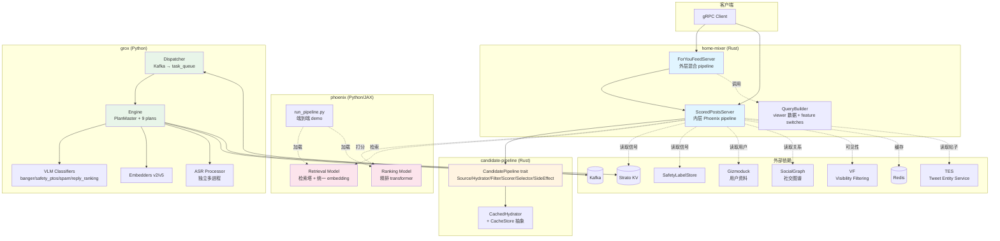
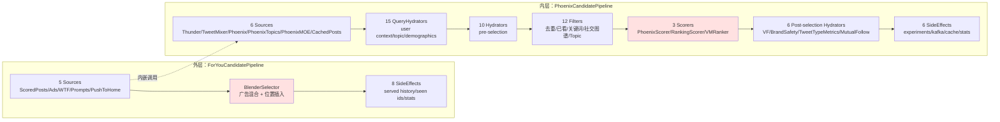
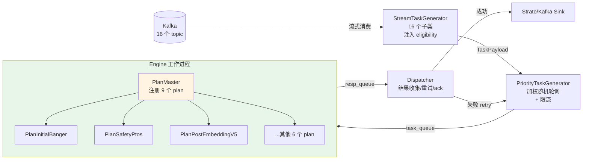
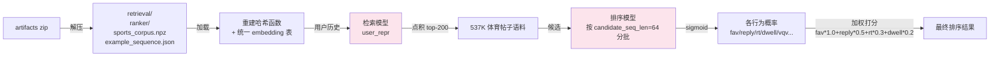
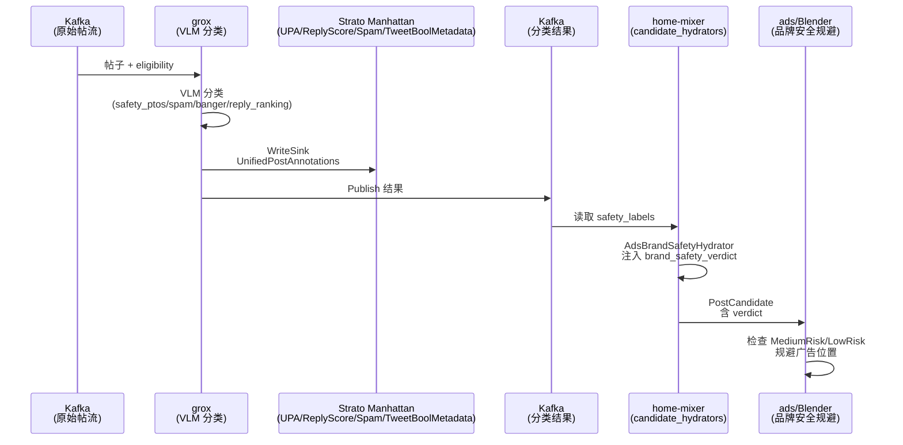
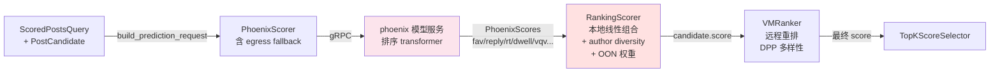
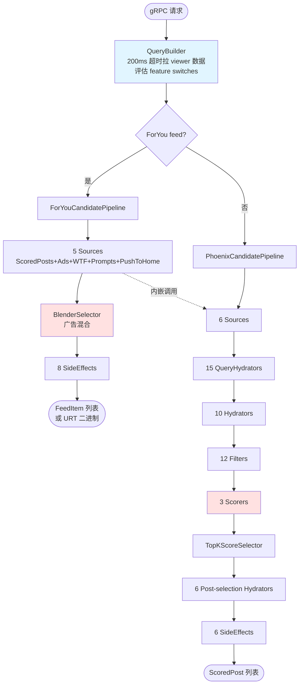

# 提交 e414c171 改动分析报告

- **提交哈希**：`e414c171ed68266341193330bc4864bf3f3534e3`
- **作者**：CI agent <support@x.ai>
- **日期**：2026-05-15
- **提交信息**：`Open-source X Recommendation Algorithm`
- **改动规模**：187 个文件，+18263 / -926 行

> 注：仓库中共有 3 个同名 "Open-source X Recommendation Algorithm" 提交（`aaa167b`、`e414c17`、`0bfc279`），本文档分析的是中间的 `e414c17`。下文描述的是该历史提交本身，不代表当前本地实现；当前 QueryBuilder 已移除 Gizmoduck viewer RPC，网络范围只由请求的 `in_network_only` 控制。

---

## TL;DR

本次提交是 **X 推荐算法的首次开源版本**，把 For You Feed 的核心代码以端到端可运行形态发布。最重要的 5 个变化：

1. **⭐ candidate-pipeline 抽象层重构**：引入 `PipelineQuery`/`SelectResult`/`CachedHydrator` 三大新抽象，filter 改同步、hydrator/scorer 改逐候选错误隔离，统一 tracing + stats 可观测性
2. **⭐ home-mixer 分层 pipeline 架构**：拆出 `ScoredPostsServer`（内层 Phoenix pipeline）+ `ForYouFeedServer`（外层混合 ads/wtf/prompts），客户端初始化从 ~8 个扩到 27 个并发块
3. **⭐ 新增 ads/ 广告混合模块**：品牌安全感知的间隙分配（PartitionOrganic / SafeGap 两种 blender），含 BSR/Handle/Keyword 三类规避规则
4. **⭐ 新增 grox/ 内容理解系统**：基于 eligibility 驱动的多 plan DAG 任务编排，集成 VLM 分类器（banger/safety_ptos/spam/reply_ranking）、多版本 embedder、独立多进程 ASR
5. **⭐ phoenix 可发布化**：补齐生产级特征（帖子年龄、连续行为、IP 哈希、右锚 RoPE），新增 `run_pipeline.py` 端到端 pipeline + 537K 体育帖子演示语料

**推荐阅读路径**：
- 想快速了解全局 → 读 TL;DR + 一、系统全景
- 想做二次开发 → 必读 二、核心架构变化（标 ⭐ 部分）+ 三、与你相关的模块详解
- 想跑通 demo → 直接看 五、phoenix 中的 run_pipeline.py 说明
- 想了解坑 → 看 六、已知问题与待复核点

---

## 目录

- [TL;DR](#tldr)
- [一、系统全景](#一系统全景)
- [二、核心架构变化（必读）](#二核心架构变化必读)
- [三、模块详解](#三模块详解)
- [四、跨模块协作链路](#四跨模块协作链路)
- [五、已知问题与待复核点](#五已知问题与待复核点)
- [附录：完整组件数量变化表](#附录完整组件数量变化表)

---

## 一、系统全景

### 1.1 整体架构



### 1.2 分层 pipeline 架构（home-mixer 核心）



### 1.3 改动规模

| 模块 | 语言 | 角色 | 文件数 | 行数变化 |
|---|---|---|---|---|
| candidate-pipeline | Rust | 候选流水线抽象框架 | 9 | +649 / -189 |
| home-mixer | Rust | Feed 编排主服务 | 108 | +10052 / -671 |
| grox | Python | 内容理解任务编排 | 59 | +6500 / 0（全新）|
| phoenix | Python | 检索 + 排序模型 | 9 | +1039 / -66 |
| 根目录 | - | README / .gitattributes | 2 | +23 / 0 |
| **合计** | - | - | **187** | **+18263 / -926** |

**home-mixer 子目录文件分布**：

```
query_hydrators/    19（18 hydrator + mod.rs）
filters/            18（17 filter + mod.rs）
candidate_hydrators/ 18（17 hydrator + mod.rs）
side_effects/       15（14 side_effect + mod.rs；另有 1 个旧文件残留）
sources/            12（11 source + mod.rs）
models/             7（6 model + mod.rs）
scorers/            4（3 scorer + mod.rs）
ads/                4（3 文件 + mod.rs）
selectors/          3（2 selector + mod.rs）
candidate_pipeline/ 3（2 pipeline + mod.rs）
根目录              5（server.rs / scored_posts_server.rs / for_you_server.rs / main.rs / lib.rs）
```

### 1.4 官方 6 大更新点（来自根 README）

1. **端到端推理 pipeline**：新增 `phoenix/run_pipeline.py`，替代 `run_ranker.py` / `run_retrieval.py`
2. **预训练模型 artifacts**：mini Phoenix 模型经 Git LFS 分发，~3GB
3. **Grox 内容理解 pipeline**：新增 `grox/` 服务，提供分类器、embedder、任务执行引擎
4. **广告混合系统**：新增 `home-mixer/ads/`，处理广告注入与品牌安全
5. **Query hydrators**：新增 followed topics、starter packs、impression bloom filter、IP、mutual follow、served history 等
6. **Candidate hydrators / sources**：新增 engagement counts、brand safety、language code、media detection、quote 展开、mutual follow 分数等

---

## 二、核心架构变化（必读）

### 2.1 ⭐ candidate-pipeline：抽象层重构

**核心方向**：引入更严格的 trait 约束、统一可观测性、新增缓存抽象。

#### 2.1.1 trait 体系变化

| 旧 | 新 |
|---|---|
| `HasRequestId` trait | `PipelineQuery`（要求 `params()` / `decider()`）+ `PipelineCandidate`（blanket impl）|
| `Filter: async fn filter -> Result<FilterResult<_>, String>` | 同步 `fn filter -> FilterResult<_>`，新增带 stats/instrument 的 `run()` 默认实现 |
| `Hydrator::hydrate -> Result<Vec<C>, String>` | `hydrate -> Vec<Result<C, String>>`（逐条错误隔离），`update_all` 跳过 Err |
| `Scorer::score -> Result<Vec<C>, String>` | `score -> Vec<Result<C, String>>`，同上 |
| `Selector::select -> Vec<C>` | `select -> SelectResult<C> { selected, non_selected }` |
| `Source::get_candidates` | 重命名为 `source`，新增 `run()` 默认实现 |
| `SideEffect::run` | `run` 成为带 stats 的默认实现，业务逻辑迁至新方法 `side_effect()` |

#### 2.1.2 新增核心抽象

- **`PipelineStage`** 新增 `DependentQueryHydrator`、`Selector`、`SideEffect` 三个变体；`PipelineComponents` 聚合各 stage 组件名用于上报。
- **`SelectResult<C>`**：区分选中/未选中候选，被截断的候选也传入 `SideEffectInput.non_selected_candidates`，保证上游计数对齐。
- **`CacheStore<K,V>` + `CachedHydrator<Q,C>`**：带缓存的 hydrator 抽象。任何 `T: CachedHydrator` 自动实现 `Hydrator`——先查缓存、miss 批量走 `hydrate_from_client` 并回填，命中/未命中记 `stat_cache`。**这是本次最重要的新增抽象**，被多个 candidate_hydrator（core_data、gizmoduck、subscription���video_duration、engagement_counts、has_media、language_code、quote、ads_brand_safety）采用。
- **`util::short_type_name`**：取类型名最后一段，用于指标标签。

#### 2.1.3 可观测性改造

全面接入 `tracing::instrument` 与 `xai_stats_macro::receive_stats`，替换原先基于 `request_id` 的 `log` 打点。`CandidatePipeline::execute` 标注 `receive_stats`，并新增 `record_enabled_components`、`log_stage(_size)`、`log_filters`、`stat_result_size` 等辅助方法。

#### 2.1.4 对调用方的影响

1. Query 类型必须实现 `PipelineQuery`（提供 `params()` / `decider()`）
2. Filter 实现方：`async fn` 改同步 `fn`
3. Hydrator / Scorer 实现方：返回类型改为 `Vec<Result<C, String>>`
4. Selector 实现方：返回 `SelectResult<C>`
5. Source 实现方：`get_candidates` 改名为 `source`
6. SideEffect 实现方：原 `run` 逻辑迁至 `side_effect`
7. 依赖 `HasRequestId::request_id` 的下游代码需改用 tracing span

---

### 2.2 ⭐ home-mixer：分层 pipeline 架构

#### 2.2.1 server.rs 大重构（450 行改动）

原 `HomeMixerServer` 仅有 `get_scored_posts` 一个方法。改后：

- **`QueryBuilder`**：从 proto query 构建 `ScoredPostsQuery`
  - `fetch_viewer_data`：200ms 超时调 Gizmoduck 获取 roles/muted_keywords/subscription_level
  - `evaluate_feature_switches`：按 user_id/country/language/app_id/account_age/has_phone 构建 Recipient，支持 overrides
  - 生成 request_id/prediction_id、0.5 抽样（`is_sampled`）、B3 tracing root_span
- **`RequestContext`**：b3_info + query + root_span
- **`ScoredPostsServer`**：实现 `ScoredPostsService`（`get_scored_posts` + `get_debug_scored_posts`，后者 force_sample 并附 debug_json）
- **`ForYouFeedServer`**：实现 `ForYouFeedService`（`get_for_you_feed` + `get_for_you_feed_urt`，后者解码 URT cursor、设置 is_bottom/top_request、序列化为 URT 二进制）
- **`XService::build`**：创建 Gizmoduck、PhoenixCandidatePipeline、ScoredPostsServer、ForYouCandidatePipeline、ForYouFeedServer，注册两个 gRPC 服务，配置 Gzip/Zstd 压缩

#### 2.2.2 分层 pipeline：外层 ForYou + 内层 Phoenix

**`for_you_candidate_pipeline.rs`（新增 278 行）**：For You Feed 外层 pipeline
- `tokio::join!` 并发创建 11 个 client
- Sources（5 个）：ScoredPosts / Ads / WhoToFollow / Prompts / PushToHome
- SideEffects（8 个）：ads_injection_logging、publish_seen_ids、served_candidates、client_events、ForYouResponseStats、UpdatePastRequestTimestamps、UpdateServedHistory、TruncateServedHistory
- selector 用 `BlenderSelector`，**不设 hydrator/filter/scorer**（由内层 ScoredPostsServer 的 Phoenix pipeline 完成）

**`phoenix_candidate_pipeline.rs`（693 行大改）**：ScoredPosts 内层 pipeline
- 客户端初始化：`tokio::join!` 并发执行 **27 个 async 初始化块**
- `build_with_clients` 函数签名接受 **20 个 client 参数**

**组件数量新旧对比**：

| 组件类型 | 旧 | 新 | 备注 |
|---|---|---|---|
| query_hydrators | 2 | **15** | 旧 2 个全删（UserActionSeq、UserFeatures），新增 15 个 |
| sources | 2 | **6** | +TweetMixer/PhoenixTopics/PhoenixMOE/CachedPosts |
| hydrators（pre-selection）| 5 | **10** | 5 保留 + 5 新增（Quote/HasMedia/BlockedBy/FilteredTopics/LanguageCode）|
| filters | 8 | **12** | +PreviouslySeenPostsBackup/Video/TopicIds/NewUserTopicIds |
| scorers | 4 | **3** | PhoenixScorer(含 egress) + RankingScorer + VMRanker，替代 PhoenixScorer+WeightedScorer+AuthorDiversityScorer+OONScorer |
| hydrators（post-selection）| 1 | **6** | VFCandidate 保留 + 5 新增（AdsBrandSafety/AdsBrandSafetyVf/TweetTypeMetrics/FollowingRepliedUsers/MutualFollowJaccard）|
| side_effects | 1 | **6** | 旧 CacheRequestInfo 替换为 PhoenixExperiments/RerankingKafka/RedisPostCandidateCache/ScoredStats/MutualFollowStats/PhoenixRequestCache |

`prod` 接受 `shard_coordinate` 与 `datacenter` 参数，并新增 `mock` 构造方法。

---

### 2.3 ⭐ ads/：广告混合（全新）

`AdsBlender` trait 在 `blend` 前统一记录帖子品牌安全 verdict 与广告风险等级的统计指标。

- **`partition_organic_blender.rs`**：将安全帖子按组划分，每组取上下两条帖子夹一个广告形成三元组。放置前依次检查 BSR Low（低风险广告两侧不能是 LowRisk 帖子）、Handle（广告黑名单作者）、Keyword（广告关键词分词匹配帖子文本）三条规避规则。剩余 filler 帖子均分到广告间隙。
- **`safe_gap_blender.rs`**：先找出所有"安全间隙"（两侧帖子均非 MediumRisk 的位置），再按 `insert_position` 理想间距用二分 `find_best_gap` 将广告逐一分配到最佳间隙，最后 `interleave_and_finalize` 插入并重排 position。
- **`util.rs`**：常量（`MIN_POSTS_FOR_ADS=5`、`DEFAULT_SPACING`）、`AdSpacing`、`has_avoid`、`compute_spacing`、各类 `should_drop_*` 规则、`record_post_verdict_stats` / `record_ad_risk_stats`。

---

### 2.4 ⭐ grox：内容理解任务编排系统（全新）

grox 是基于 eligibility 驱动的多 plan DAG 任务编排系统，59 个 Python 文件。

#### 2.4.1 整体流程



#### 2.4.2 plan DAG 执行（plan.py 核心）

每个 Plan 声明 `TASKS`（任务字典）和 `TASK_DEPENDENCIES`（邻接表），执行时为每个依赖创建 `asyncio.Future`，`asyncio.gather` 并发调度所有任务，任务 await 其依赖 future 后执行。依赖返回 SKIPPED 时传播跳过。通过 `REQUIRED_ELIGIBILITY` 过滤，只有 payload 携带对应 eligibility 的 plan 才执行。

**plan_master.py 注册的 9 个 plan**：
1. PlanInitialBanger
2. PlanPostSafety
3. PlanSpamComment
4. PlanPostEmbeddingWithSummary
5. PlanPostEmbeddingWithSummaryForReply
6. PlanPostEmbeddingV5
7. PlanPostEmbeddingV5ForReply
8. PlanReplyRanking
9. PlanSafetyPtos

各 plan 任务链共性：**Filter → RateLimit → MediaHydration → 核心分类/嵌入 → Publish(Sink/Kafka)**。

#### 2.4.3 核心组件

- **VLM 分类器**（classifiers/content/）：banger_initial_screen、safety_ptos（两阶段）、spam、reply_ranking、post_safety_screen_deluxe
- **Embedder**（embedder/）：v2 多模型多渲染器 vs v5 单一模型 + 截断降维 + ASR transcript
- **ASR Processor**（data_loaders/asr_processor.py）：独立多进程，ffmpeg → WAV → base64 → LLM 转录

---

### 2.5 ⭐ phoenix：从可训练模型到可发布 pipeline

#### 2.5.1 模型增强（recsys_model.py，254 行）

- **帖子年龄分桶**：`compute_post_age_bucket`，按 `granularity_mins`（默认 60 分钟）分桶，上限 4800 分钟（80 小时）
- **连续行为嵌入**：dwell_time 经两层 MLP + GELU 投影到 embedding 维度，拼入 history 序列
- **IP 地址哈希**：`HashConfig.num_ip_hashes` 新字段，可将 IP embedding 求和叠加到 user 表示
- **连续行为预测头**：`continuous_preds`，8 个连续 action（dwell_time、video_watch_time、scroll_depth 等），支持 MAE/Tweedie loss
- **右锚 RoPE**：`right_anchored_rope: bool`，让最新历史 token 固定位置，与序列填充长度无关

#### 2.5.2 端到端 pipeline（run_pipeline.py，393 行，新增）



#### 2.5.3 检索塔轻量化（recsys_retrieval_model.py）

`CandidateTower` 新增 `enable_linear_proj` 开关：
- `True`（默认）：原两层 MLP(SiLU) + L2 归一化
- `False`：仅对 hash 维度做 mean pooling + L2 归一化，**零参数**，更省内存

---

## 三、模块详解

### 3.1 home-mixer/models/：数据模型迁移与丰富

原 `candidate_pipeline` 下的 `candidate`/`candidate_features`/`query`/`query_features` 子模块迁至 `models/`，并新增多个模型：

| 文件 | 内容 |
|---|---|
| `candidate.rs` | `PostCandidate`（40+ 字段：tweet_id、author_id、phoenix_scores、safety_labels、brand_safety_verdict 等）；`CandidateHelpers` trait（`get_screen_names`、`get_original_tweet_id`、`as_tweet_info` 转 recsys TweetInfo）|
| `candidate_features.rs` | `BlockedByUserIds`、`TopicFilteringExperiment`（6 档）、`FilteredTopicsByExperiment`，thrift MValCodec 只读 |
| `query.rs` | `ScoredPostsQuery`：user_id、seen_ids、user_features、params、decider、topic_ids、cursor、scoring/retrieval_sequence、demographics、grok topics 等；实现 `PipelineQuery` + `GetTwitterContextViewer` |
| `user_features.rs` | `UserFeatures`：muted_keywords、blocked/muted/followed/subscribed_user_ids、follower_count |
| `brand_safety.rs` | `BrandSafetyVerdict`（Unspecified/Safe/LowRisk/MediumRisk）；`compute_verdict` 按 MEDIUM_RISK_LABELS/LOW_RISK_LABELS 判定，PTOS_CUTOFF 后需 PTOS_REVIEWED 标签 |
| `in_network_reply.rs` | `InNetworkReply` + `OnceLock` 包装的 `InNetworkReplies` |

### 3.2 home-mixer/candidate_hydrators/：11 个新增 + 6 个修改

**新增 hydrator（11 个）**：

| Hydrator | 注入字段 | 外部服务 |
|---|---|---|
| `AdsBrandSafetyHydrator` | `brand_safety_verdict` + `safety_labels` | `SafetyLabelStoreClient.batch_get_all_labels`（Moka 缓存，按推文年龄过期）|
| `AdsBrandSafetyVfHydrator` | 同上 | `VfClient.get_safety_labels`（需 `vf_brand_safety_dark_traffic` decider）|
| `BlockedByHydrator` | `author_blocks_viewer` | `SocialGraphClient.check_blocked_by` |
| `EngagementCountsHydrator` | `fav/reply/repost/quote_count` | `TESClient.get_api_counts`（Moka 缓存）|
| `FilteredTopicsHydrator` | `filtered_topic_ids` + `unfiltered_topic_ids` | `StratoClient.batch_get_filtered_topics_by_experiment` |
| `FollowingRepliedUsersHydrator` | `following_replied_user_ids`（facepile）| 无，本地聚合 `query.in_network_replies` |
| `HasMediaHydrator` | `has_media` | `TESClient.get_has_media`（Moka 缓存）|
| `LanguageCodeHydrator` | `language_code` | `TESClient.get_language_code`（Moka 缓存）|
| `MutualFollowJaccardHydrator` | `mutual_follow_jaccard` | `StratoClient.batch_get_minhash_with_count`（本地 minhash 算 Jaccard）|
| `QuoteHydrator` | `quoted_tweet_id/user_id`、`quoted_author_blocks_viewer`、`quoted_video_duration_ms` | `TESClient` + `SocialGraphClient`（自定义 Moka 缓存）|
| `TweetTypeMetricsHydrator` | `tweet_type_metrics`（bitset 字节）| 无，纯本地按候选属性 + query 计算 |

**修改的 hydrator（6 个）共性变化**：
1. 模块路径：`crate::candidate_pipeline::{candidate,query}` → `crate::models::{candidate,query}`
2. `hydrate` 返回 `Vec<Result<PostCandidate, String>>`（每候选独立错误）
3. 多个升级为 `CachedHydrator`，引入 `MokaCache`（core_data、gizmoduck、subscription、video_duration）
4. `vf_candidate_hydrator.rs` 大幅扩展：现对 `ancestors`/`quoted_tweet_id`/`retweeted_tweet_id` 一并做 VF 检查；新增 `drop_ancillary_posts` 字段及 `should_drop_ancillary`/`should_drop_reason` 逻辑
5. ID 类型 `i64` → `u64`

### 3.3 home-mixer/filters/：topic_ids_filter 与新过滤器

**`topic_ids_filter.rs`（571 行，新增）**：基于 `query.topic_ids` 过滤候选。三种模式：
- bulk topic request：展开 query topic 到全量生产 topic，反向排除未命中候选
- 普通 topic request：每个候选的 `filtered_topic_ids`/`unfiltered_topic_ids` 与查询 topic 的 `category_ids`（父→子展开）或 `expand_supertopic`（子→父聚合）匹配
- excluded topics：从 kept 中再剔除 expanded excluded topic

核心 `TopicIdExpansion`：`category_ids()` 维护父 topic 到子 topic 列表的大映射表（SCIENCE_TECHNOLOGY 展开 8 个子项、SPORTS 展开近 40 个联赛等）；`supertopic()` 做反向映射（K_POP→MUSIC、NBA→BASKETBALL 等）。`TopicFilteringOverrideMap` 解析 `"tid=ExperimentId"` 字符串按 query topic 切换实验。

**其他新增过滤器（4 个）**：
- `ancillary_vf_filter.rs`：按候选 `drop_ancillary_posts` 标志丢弃辅助帖
- `new_user_topic_ids_filter.rs`：新用户场景（`EnableNewUserTopicFiltering` + `has_new_user_topic_ids`），保留 in_network 帖或匹配 expanded topic 的帖
- `previously_seen_posts_backup_filter.rs`：用 `query.impressed_post_ids` 与候选的 related_post_ids 求交集去重
- `video_filter.rs`：`query.exclude_videos` 开启时丢弃有视频的候选

**修改的过滤器（12 个）共性**：移除 `#[async_trait]`、`async fn`→`fn`、返回类型简化；import 路径迁移。特例：
- `author_socialgraph_filter.rs`：扩展拦截条件，新增 `author_blocks_viewer`、`quoted_author_blocks_viewer`、`viewer_blocks_quoted_author`、`viewer_blocks_retweeted_user`
- `muted_keyword_filter.rs`：用 `tokio::task::block_in_place` 包装同步分词逻辑
- `previously_served_posts_filter.rs`：引入 `EnableServedFilterAllRequests` 全量开关 + `RequestContext::ForegroundTruncate` 判断

### 3.4 home-mixer/scorers/：本地精排重构

- **`phoenix_scorer.rs`（修改）**：新增 `egress_client` 字段（sidecar 调用，失败 fallback）；新增 `resolve_cluster()`（新用户历史短时切专用 cluster）；删除本地 `build_predictions_map`/`extract_phoenix_scores`，改用 `build_prediction_request()` + `predictions.candidate_scores()`；引入 `ProductSurface` 区分 `HomeTimelineRankedFollowing`/`HomeTimelineRanking`
- **`ranking_scorer.rs`（290 行，新增）**：本地精排，替代旧 `weighted_scorer`/`author_diversity_scorer`/`oon_scorer`
  - `ScoringWeights::from_params` 从 22+ 个 feature switch 读取权重
  - `compute_weighted_score`：线性组合 PhoenixScores（fav/reply/retweet/vqv/share/dwell/quote/follow_author 正向 + not_interested/block/mute/report 负向），含 vqv/quoted_vqv 视频时长门控
  - `apply_author_diversity`：按分数排序，对同一作者的连续位置施加 `(1-floor)*decay^pos+floor` 衰减乘子
  - `effective_oon_weight`：topic 请求用 `TopicOonWeightFactor`；新用户用 `NEW_USER_OON_WEIGHT_FACTOR`；in_network=false 的候选乘以 OON 权重
- **`vm_ranker.rs`（132 行，新增）**：远程 Value Model Ranker 客户端（`EnableVMRanker` 开关）。构建 `RankRequest`，把 phoenix_scores 打包成 proto，附 author_followers_count/is_retweet/is_reply/vqv_ineligible 等特征；支持 DPP 多样性参数 `VMRankerDppTheta`/`VMRankerDppMaxSelectedRank`

### 3.5 home-mixer/selectors/：BlenderSelector

`BlenderSelector` 负责 Feed 最终编排：
- `partition_feed_items` 拆分 posts/ads/wtf_modules/prompts/push_to_home
- 按 `AdsBlenderType` 选 blender（`"safe_gap"` → `SafeGapAdsBlender`，默认 `PartitionOrganicAdsBlender`）
- `insert_prompts`（按序插前部）、`insert_who_to_follow`（插到 `WHO_TO_FOLLOW_POSITION`）、`pin_push_to_home`（钉在 position 0）
- 统计被 blender 丢弃的 posts/ads，生成默认占位 `FeedItem` 放入 `non_selected`

### 3.6 home-mixer/side_effects/（14 个）与 sources/（11 个）

**side_effects（14 个新增模块 + 1 个 mod.rs）**：`ads_injection_logging`、`client_events_kafka`、`for_you_response_stats`、`mutual_follow_stats`、`phoenix_experiments`、`phoenix_request_cache`、`publish_seen_ids_to_kafka`、`redis_post_candidate_cache`、`reranking_kafka`、`scored_stats`、`served_candidates_kafka`、`truncate_served_history`、`update_past_request_timestamps`、`update_served_history`

> 旧版唯一的 `cache_request_info_side_effect.rs` 文件在 mod.rs 中不再导出，但文件本身保留在仓库中——已成死代码（详见"已知问题"）。

**sources（11 个模块 + 1 个 mod.rs）**：`ads_source`、`cached_posts_source`、`phoenix_moe_source`、`phoenix_source`、`phoenix_topics_source`、`prompts_source`、`push_to_home_source`、`scored_posts_source`、`thunder_source`、`tweet_mixer_source`、`who_to_follow_source`

### 3.7 grox 详细组件

#### 3.7.1 schedules/：进程协调基础设施

- **types.py**：`TaskEligibility`（**10 种枚举**：BANGER_INITIAL_SCREEN��SPAM_COMMENT、REPLY_RANKING、SAFETY_PTOS、POST_SAFETY、POST_EMBEDDING_WITH_SUMMARY、POST_EMBEDDING_WITH_SUMMARY_FOR_REPLY、MM_EMB_V4、MM_EMB_V5、MM_EMB_V5_FOR_REPLY）、`TaskPayload`、`TaskResult`、`TaskContext`
- **context.py**：`ScheduleContext` 即 `DictProxy`，承载 task_queue/resp_queue/shutdown_event 等共享对象
- **init.py**：进程初始化（日志、Metrics、setproctitle、周期性 GC 防内存碎片）

#### 3.7.2 generators/：任务来源与限流

- **task_generator.py**：`TaskGenerator` 抽象基类内置 FixedWindow 限流（max_qps）；`PriorityTaskGenerator` 按权重随机选择子生成器，维护 `result_cache` 路由 ack
- **stream_generator.py**：`StreamTaskGenerator` 绑定一个 Kafka loader + 一组 `ELIGIBILITIES_TO_INJECT`。**16 个子类**对应不同 Kafka topic，例如：
  - `PostStreamTaskGenerator`：主帖流，注入 SPAM_COMMENT + REPLY_RANKING
  - `MinTractionPostStreamForGroxTaskGenerator`：低互动帖，注入 BANGER
  - `PostEmbeddingV5StreamTaskGenerator`：embedding 请求，注入 MM_EMB_V5
  - 其余：PtosRecovery、SafetyDeluxe、SafetyRecovery、PostStreamRecovery、PostStreamDelayed、PostStreamTest、ReplyRankingRecovery、PostEmbeddingRequestWithSummary(+Recovery+ForReplyRecovery)、PostEmbeddingV5ForReply

#### 3.7.3 classifiers/content/：VLM 内容分类器

`classifier.py` 定义 `ContentClassifier` 抽象基类：`_to_convo`（构建对话）→ `_sample`（VLM 采样）→ `_parse`（解析 JSON）。

| 分类器 | 作用 |
|---|---|
| `banger_initial_screen` | VLM 生成 quality_score（>=0.4 为 banger）、slop_score、has_minor_score、taxonomy 标签 |
| `safety_ptos` | 两阶段：`SafetyPtosCategoryClassifier` 检测违规类别（7 类政策），`SafetyPtosPolicyClassifier` 做具体政策判定；deluxe 模式支持 EAPI reasoning + thinking 限制剥离 |
| `spam` | 低粉丝用户回复 spam 检测，输出 decision(spam/not_spam) |
| `reply_ranking` | 回复打分 0-3，主模型 VLM_MINI_CRITICAL，失败 fallback 到 VLM_PRIMARY_CRITICAL，含 json_repair 容错 |
| `post_safety_screen_deluxe` | 输出 TweetBoolMetadata 安全布尔标注 |

#### 3.7.4 data_loaders/：数据接入

- **message_queue_loader.py**：抽象接口（start/stop/poll/ack）
- **kafka_loader.py**：`KafkaLoader` 基类实现预取（prefetcher 协程 + ThreadPoolExecutor 12 线程并行反序列化），4 个子类按 thrift 格式区分（Post/EmbeddingRequest/GroxContentAnalysis/TweetEmbedding）
- **strato_loader.py**：Strato KV 存储读写封装（Tweet/User 水合、ReplyRanking/Spam 保存、UserRecentPosts 加载并批量水合+安全标签扫描）
- **asr_processor.py**：独立多进程 ASR。`_ASRWorker` 子进程中用 ffmpeg 提取 WAV → base64 → LLM `/v1/chat/completions` 转录，支持 max_workers 并发、TTLCache(300s) 去重、错误分类（ffmpeg_timeout/asr_timeout/no_audio_stream）

#### 3.7.5 embedder/：多模态嵌入版本差异

- **v2**（`multimodal_post_embedder_v2.py`）：支持多模型切换（qwen3 0.6b/8b、recsys_v4、video client、custom endpoint），多渲染器（lite/eval/mmembed_summary），可选注入 grok summary、media descriptions、post context summary。两种 document 构造策略（original/v1，处理图像/视频帧/字幕）
- **v5**（`multimodal_post_embedder_v5.py`）：使用 `RECSYS_EMBED_V5` HTTP 客户端 + `V5EmbedPostRenderer`，`encode_with_embedded_pads` 编码，截断到 1024 维并 L2 归一化，支持 ASR transcript 拼接，细粒度性能指标（render/encode/truncate 分阶段计时）。v5 更轻量、更面向生产（固定单一模型 + 截断降维）

#### 3.7.6 tasks/（22 个文件）功能分类

- `task.py`：`Task` 抽象基类，类方法执行（非实例化），支持 `DISABLE_RULES` 环境禁用、`should_skip`、tenacity 重试（2 次）。子类模板：`TaskWithPost`/`TaskWithUser`/`TaskWithUserContext`/`TaskWithContentAnalysis`，缺数据抛 `TaskStopExecution`。返回 SUCCESS/SKIPPED
- `disable_rules.py`：5 种环境禁用规则（local/dev/non-prod/non-mm-emb-prod/non-ptos-prod）
- `task_filters.py`（371 行）：前置资格判断（spam 要求回复+低粉丝、reply_ranking 要求高粉丝、banger 要求非回复非私密账号）
- `task_rate_limit.py`：TTLCache 去重限流，每个 plan 独立限流类
- `task_pub.py`（556 行，最大）：发布结果到 Kafka + Strato Manhattan��UnifiedPostAnnotations、ReplyRankingScore、ReplySpam、TweetBoolMetadata upsert）
- `task_multimodal_post_embedding.py`：3 个 embedding 任务（v3=WithSummary、v4=RecsysV4、v5=V5+transcript）
- `task_write_mm_embedding_sink.py` / `task_write_safety_post_annotations_result_sink.py`：写 Strato sink（含 retry）
- `task_asr.py` / `task_media.py` / `task_load_post*`：媒体水合与数据加载
- `task_safety_ptos_category/policy.py` / `task_banger_screen.py` / `task_spam_detection.py` / `task_rank_replies.py`：调用对应 classifier
- `task_summarizer_for_post_embedding.py` / `task_grok_upa_action_with_labels.py` / `task_embedding_pub.py` / `task_post_safety_screen_deluxe.py`：摘要、UPA 动作、embedding 发布、安全屏幕

#### 3.7.7 summarizer/ 与 lib/

- **summarizer/**：`summarizer.py` / `eapi_summarizer.py` 两个并列抽象基类（分别封装 VLM 和 EAPI 采样器）；`post_embedding_summarizer.py` 用 VLM_MINI_CRITICAL 生成 post 描述摘要，供 embedding 流水线使用
- **lib/stream.py**：`parallel_merge` 将多个 AsyncIterator 并行汇入一个 Queue，任一抛异常则传播
- **lib/utils.py**：`camel_to_snake` / `snake_to_camel` 命名转换（用于 metrics 标签）

### 3.8 phoenix 详细改动

#### 3.8.1 runners.py（84 行）

- 新增 `load_model_params` / `load_embedding_table`：从 npz 恢复 Haiku 参数与 embedding 表
- `ModelRunner.create_training_state` 支持 `checkpoint_path`，直接加载而非随机初始化
- 新增 `CONTINUOUS_ACTIONS`（dwell_time、video_watch_time、scroll_depth 等 8 项）与 `NEGATIVE_FEEDBACK_INDICES=[14,15,16,17]`
- `RankingOutput` 增加 `continuous_preds` 字段
- `create_example_batch`：user/item/author vocab 从 100K 提升至 1M；新增 `include_continuous_actions`、`include_timestamps` 开关

#### 3.8.2 grok.py — 自定义 RoPE 位置（40 行）

新增 `right_anchored_rope_positions(padding_mask, history_seq_len, num_user_prefix_tokens)`：让历史区段按"右锚"方式分配位置（最新 token 固定在 `history_end`），候选区段共享同一位置，padding 归零。`positions` 参数从 `Transformer` → `DecoderLayer` → `MHABlock` → `MultiHeadAttention` 一路透传，`RotaryEmbedding.rotate` 接受自定义 `t` 位置张量。

#### 3.8.3 README.md 与 artifacts

**mini 配置（按 phoenix/README.md）**：

| 参数 | 值 |
|---|---|
| Embedding 维度 | 128 |
| Transformer 层数 | 4 |
| 注意力头数 | 4 |
| Key size | 32 |
| Widening factor | 2 |
| History 序列长度 | 127 |
| Candidate 序列长度 | 64 |
| User/Item/Author vocab | 1,000,000 each |
| 哈希数 / 实体 | 2 |
| Action 类型 | 19 |

`phoenix/artifacts/oss-phoenix-artifacts.zip`（Git LFS）是 pipeline 必需依赖，解压后含：
- `retrieval/` 与 `ranker/` 各自的 `model_params.npz`（~3MB 权重）、`embedding_tables.npz`（~1.4GB，user/item/author 各 1M 词表）、`config.json`
- `sports_corpus.npz`：537K 体育帖子的预计算候选表示
- `example_sequence.json`：示例用户历史（NFL/NBA/NHL 三条点赞+停留）

#### 3.8.4 测试变化（共 236 行）

- `test_recsys_model.py`：新增 `TestRightAnchoredRopePositions`（形状、prefix 保留、候选共享位置、padding 归零）、`TestComputePostAgeBucket`（基本分桶、2 小时、缺失时间戳、负年龄、overflow、批处理）、`TestNormalizeContinuousValue`（线性/对数归一化、截断）
- `test_recsys_retrieval_model.py`：为 mean pooling 模式补测试，关键断言 `test_mean_pooling_has_no_params` 验证参数数为 0，新增 `test_mean_pooling_model_forward` 验证整模型前向

---

## 四、跨模块协作链路

### 4.1 内容理解信号流：grox → Strato/Kafka → home-mixer



**关键点**：grox 输出的 PTOS 安全标签，通过 Strato 被 home-mixer 的 `AdsBrandSafetyHydrator` 注入候选帖，最终影响 `ads/` 模块的广告位置决策（避免广告出现在敏感内容旁）。

### 4.2 模型打分链路：home-mixer → phoenix → home-mixer



### 4.3 完整请求链路



---

## 五、已知问题与待复核点

以下是在分析过程中发现的不一致或需要关注的问题，供后续维护者参考：

### 5.1 文档与代码的不一致

**mini 模型配置在两份 README 中描述矛盾**：
- 根目录 `README.md` 说 mini Phoenix 是 **"256-dim embeddings, 4 attention heads, 2 transformer layers"**
- `phoenix/README.md` 说是 **"128-dim, 4-layer transformer"**（并给出详细配置表：128 维/4 层/4 头/key 32）

两处是 X 官方文档自身的矛盾，真实配置应以 `artifacts/oss-phoenix-artifacts.zip` 中 `config.json` 为准。

### 5.2 疑似死代码

1. **`home-mixer/side_effects/cache_request_info_side_effect.rs`**：本次提交从 `mod.rs` 中移除了 `pub mod cache_request_info_side_effect;`，但**文件本身保留在仓库中**（未被删除、也未被修改）。该文件已成不再被编译的死代码，建议后续清理。

2. **`phoenix_candidate_pipeline.rs` 中的 `_impressed_posts_hydrator`**：以变量名前缀下划线的方式创建实例但未实际加入 pipeline，看起来是"先实例化、后续再接入"的占位代码：
   ```rust
   let _impressed_posts_hydrator = ImpressedPostsQueryHydrator {
       client: impressed_posts_client,
   };
   ```
   同时 `impressed_posts_client` 在 mock 路径中有完整初始化，但 `_impressed_posts_hydrator` 未被使用——需要确认是有意保留（待启用）还是遗漏。

### 5.3 同名提交辨析

仓库中存在 3 个同名 `Open-source X Recommendation Algorithm` 提交：`aaa167b`、`e414c17`、`0bfc279`。本文档分析的是 `e414c17`（按本任务指定）。三者的关系（如是否为同一提交的不同 rebase 版本）未在本文档中考察。

---

## 附录：完整组件数量变化表

### Phoenix pipeline（内层）组件变化

| 组件类型 | 旧 | 新 | 备注 |
|---|---|---|---|
| query_hydrators | 2 | **15** | 旧 2 个全删（UserActionSeq、UserFeatures），新增 15 个 |
| sources | 2 | **6** | +TweetMixer/PhoenixTopics/PhoenixMOE/CachedPosts |
| hydrators（pre-selection）| 5 | **10** | 5 保留 + 5 新增 |
| filters | 8 | **12** | +PreviouslySeenPostsBackup/Video/TopicIds/NewUserTopicIds |
| scorers | 4 | **3** | PhoenixScorer(含 egress) + RankingScorer + VMRanker |
| hydrators（post-selection）| 1 | **6** | VFCandidate 保留 + 5 新增 |
| side_effects | 1 | **6** | CacheRequestInfo → PhoenixExperiments/RerankingKafka/RedisPostCandidateCache/ScoredStats/MutualFollowStats/PhoenixRequestCache |

### ForYou pipeline（外层）组件

| 组件类型 | 数量 |
|---|---|
| sources | 5（ScoredPosts/Ads/WhoToFollow/Prompts/PushToHome）|
| selector | 1（BlenderSelector）|
| side_effects | 8 |
| hydrators/filters/scorers | 0（由内层 Phoenix pipeline 完成）|

### candidate_hydrators 变化

- 新增：11 个（见 3.2 节表格）
- 修改：6 个（core_data、gizmoduck、in_network、subscription、vf_candidate、video_duration）
- 删除：0 个（mod.rs 中模块声明增加）

### filters 变化

- 新增：5 个（topic_ids、ancillary_vf、new_user_topic_ids、previously_seen_posts_backup、video）
- 修改：12 个（共性：去 async、路径迁移）
- 删除：0 个

### grox 关键规模

- 总文件数：59
- plans：9 个
- stream task generators：16 个子类
- task eligibilities：10 种
- tasks/：22 个文件
- classifiers/content/：6 个分类器文件
