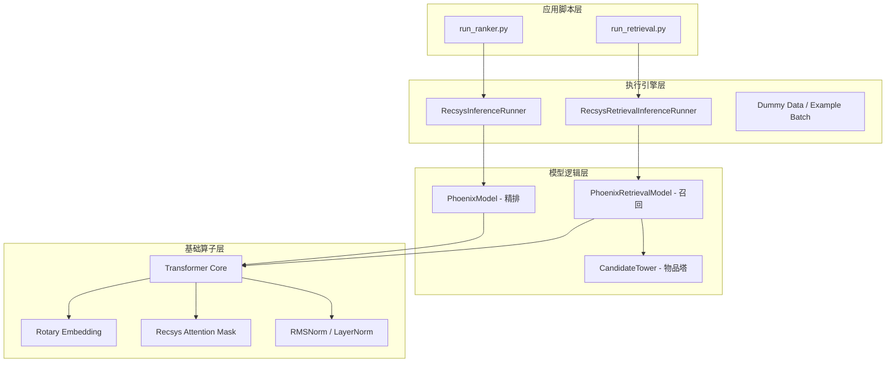
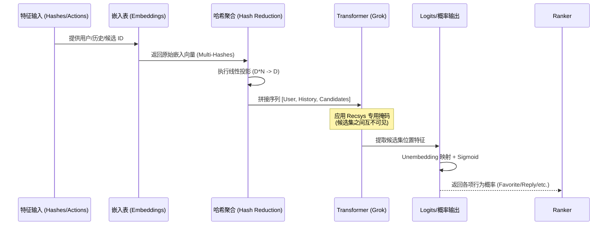
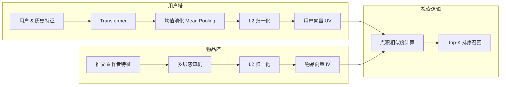

# Phoenix 推荐系统架构与流程文档

本文档详细描述了 Phoenix 推荐系统的系统架构、精排逻辑以及召回逻辑。

## 1. 系统架构图

系统采用模块化设计，底层基于 JAX/Haiku 实现，各组件职责清晰：

---

## 2. 精排业务流程图 (Ranking Flow)

精排模型将用户信息、历史行为和候选集拼接为长序列，利用 Transformer 的上下文建模能力进行评分。

---

## 3. 召回业务流程图 (Retrieval Flow)

召回系统采用双塔架构，通过用户塔和物品塔的向量化映射实现高效检索。

---

## 4. 关键技术点
1.  **旋转位置嵌入 (RoPE):** 在 `grok.py` 中实现，使 Transformer 能够捕捉历史行为的相对时序特征。
2.  **推荐系统专用掩码:** 确保在一次 Transformer 前向计算中，多个候选推文能够同时评分且互不干扰。
3.  **多头哈希 (Multi-Hash):** 缓解了大规模 ID 的碰撞问题，提高了特征表示的鲁棒性。
4.  **双塔架构:** 支持离线预计算物品向量库，在线仅需编码用户向量，极大提升了召回效率。
